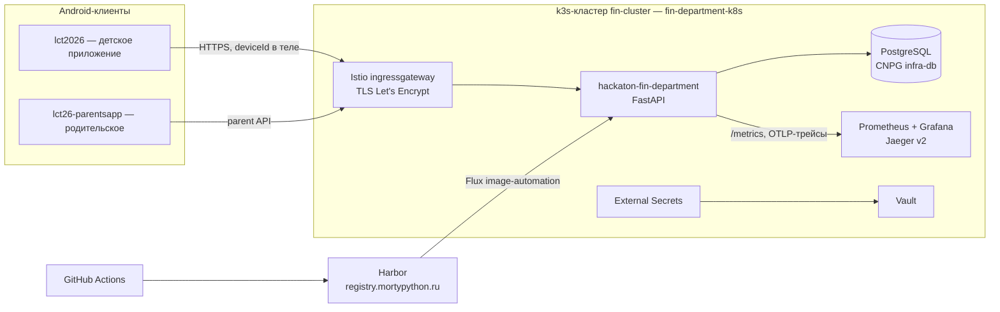

# «Лапки и монеты»

Комплекс из четырёх репозиториев: детская Android-игра про финансовую
грамотность (питомец, экономика, сюжет, навыки), родительское
приложение-компаньон, HTTP-бэкенд и GitOps-инфраструктура вокруг них.

## Репозитории

| Репозиторий | Что это |
| --- | --- |
| [lct2026](https://github.com/salyamii/lct2026) | Детское Android-приложение (основная игра) — этот репозиторий |
| [lct26-parentsapp](https://github.com/HighlyLoadedEgo/lct26-parentsapp) | Родительское Android-приложение-компаньон |
| [hackaton-fin-department](https://github.com/OptikRUS/hackaton-fin-department) | HTTP-бэкенд: профиль устройства, облачные снапшоты, аналитика, награды |
| [fin-department-k8s](https://github.com/HighlyLoadedEgo/fin-department-k8s) | GitOps (Flux) для single-node k3s-кластера, где живёт бэкенд |

## Содержание

- [Исследования и дизайн](#исследования-и-дизайн)
  - [Дизайн](#дизайн)
  - [Исследования](#исследования)
  - [Аудио](#аудио)
  - [Подходы на основе исследований](#подходы-на-основе-исследований)
- [Архитектура приложения](#архитектура-приложения)
  - [Общая схема](#общая-схема)
  - [lct2026 — детское приложение](#lct2026--детское-приложение)
  - [lct26-parentsapp — родительское приложение](#lct26-parentsapp--родительское-приложение)
  - [hackaton-fin-department — HTTP-бэкенд](#hackaton-fin-department--http-бэкенд)
  - [fin-department-k8s — GitOps-инфраструктура](#fin-department-k8s--gitops-инфраструктура)
  - [CI/CD и наблюдаемость](#cicd-и-наблюдаемость)
  - [Быстрый старт](#быстрый-старт)

## Исследования и дизайн

### Дизайн

Макеты всех экранов игры — Figma-файл
[«Питомец. Дизайн»](https://www.figma.com/design/bAod1cKtTX9Q8omQ067q3q/%D0%9F%D0%B8%D1%82%D0%BE%D0%BC%D0%B5%D1%86-%D0%94%D0%B8%D0%B7%D0%B0%D0%B9%D0%BD).

Правила работы с арт-ассетами, их происхождение и доступность описаны в
[гайде по artwork](docs/design/assets/README.md) и
[каталоге ассетов](docs/design/assets/catalog.md).

### Исследования

Доска исследований команды (интервью, ЦА, гипотезы, игровые механики) —
FigJam
[«2026 фин. питомец»](https://www.figma.com/board/mlTEA1hlLJPYf1yRX5a739/2026-%D1%84%D0%B8%D0%BD-%D0%BF%D0%B8%D1%82%D0%BE%D0%BC%D0%B5%D1%86).

### Аудио

Аудио-пак (озвучка событий, короткие эффекты оплаты и появления покупок) —
[Google Drive](https://drive.google.com/drive/folders/1LEU5RhyiwvKXKCfZvLElC2FSSrU9Jkkp?usp=sharing).
Имена файлов задают соответствующие сюжетные события и неожиданные траты;
архив и точные повторы учитываются в media manifest приложения.

### Подходы на основе исследований

> TODO: описать, какие подходы и механики взяты из исследований и как они
> воплощены в продукте — набор навыков FIN-01…FIN-12, экономика и бюджет,
> сюжетные сценарии, родительская обратная связь.

## Архитектура приложения

### Общая схема



Публичный адрес бэкенда — `https://fin-api.mortypython.ru`. Авторизации в
контракте v1 нет: профиль клиента определяется строкой `deviceId` (ANDROID_ID),
которую Android передаёт в теле каждого запроса (см.
[docs/backend/README.md](docs/backend/README.md)).

### lct2026 — детское приложение

Нативное Android-приложение: офлайн-first игра с питомцем, внутриигровой
экономикой, сюжетом и развитием финансовых навыков ребёнка. Локально — Room
как источник текущего мира; облако — бэкап/рестор снапшота, передача фактов
и навыков, доставка родительских наград.

**Стек:** Kotlin, Jetpack Compose, Material 3, Navigation 3, усиленный MVVM
(UDF, immutable `UiState` в `StateFlow`, явные UI-действия), Hilt, Room,
Preferences DataStore, Retrofit + OkHttp + Kotlinx Serialization, WorkManager
(долгоживущие фоновые загрузки/ретраи), JUnit 4 + Compose UI-тесты.

**Структура:**

- `:core:game` — чистый Kotlin-домен: игровой агрегат, команды, правила,
  контент, история, финансовые проекции, контракты снапшотов и бэкенда;
- `:app` — композиция, Hilt-граф, навигация, Room, установка контента,
  транспорт к бэкенду (`data/backend`), identity устройства (`deviceId`);
- `:feature:onboarding`, `:feature:debug` — отдельные Gradle-модули UI;
- `:feature:parents` — родительский режим: PIN-гейт, локальные свидетельства
  и серверные оценки навыков (родительская функциональность адаптирована
  из `lct26-parentsapp`, открывается долгим нажатием на шестерёнку);
- `docs/` — архитектура, навигация, контракт с бэкендом (`docs/backend/`)
  со схемами OpenAPI и генератором проверенных примеров.

Ключевые правила: одна игровая единица записи коммитится атомарно
(питомец + экономика + сюжет), UI не знает про навигационные объекты,
домен не зависит от Android. Подробности — [docs/architecture.md](docs/architecture.md).

### lct26-parentsapp — родительское приложение

Приложение-компаньон для родителей на том же стеке (Kotlin + Jetpack Compose +
Material 3, MVVM): родитель видит, как ребёнок осваивает финансовые навыки —
отчёт по навыкам с серверными статусами `MASTERED`/`PRACTICING`/`NO_DATA`/
`HAS_PROBLEM`, доступ защищён PIN-кодом. Профиль ребёнка открывается по QR
(строка `deviceId`), данные читаются с бэкенда по родительскому API.
Его наработки (PIN-гейт, отчёт по навыкам) легли в основу `:feature:parents`
внутри `lct2026`, где родительский режим встроен прямо в игру.

**Стек:** Kotlin, Jetpack Compose, Material 3, Hilt, Room, Navigation 3.

### hackaton-fin-department — HTTP-бэкенд

Единый бэкенд для обоих приложений. Хранит профиль устройства и питомца,
принимает и отдаёт полный архив мира (world snapshot), принимает факты
геймплея и считает оценки навыков, доставляет родительские награды и отдаёт
родительский отчёт (пока демонстрационная заглушка). Живёт в кластере на
`fin-api.mortypython.ru`.

**Стек:** Python 3.14, FastAPI, Dishka (DI), SQLAlchemy, PostgreSQL
(миграции через `make migrate`), OpenTelemetry (OTLP gRPC трейсы → Jaeger,
метрики Prometheus через `GET /metrics`), uv, Ruff, mypy, pytest + behave
(BDD), Docker Compose для локальной разработки.

**Структура `src/`:** `core/` (домен: `pets`, `profiles`, `snapshots`,
`analytics`, `rewards`), `infra/` (API, storages, migrations, observability),
`di/`, `config/`, `tests/` (включая BDD).

**Ключевые методы мобильного API:**

| Метод | Путь | Назначение |
| --- | --- | --- |
| `POST` | `/api/pets` | Регистрация `deviceId` и питомца |
| `PUT` | `/v1/profiles/snapshot` | Загрузка полного архива мира |
| `POST` | `/v1/profiles/snapshot/download` | Получение последнего архива |
| `POST` | `/v1/profiles/analytics` | Передача фактов и навыков |
| `POST` | `/v1/profiles/skills/query` | Оценки навыков (`MASTERED`/`PRACTICING`/`NO_DATA`/`HAS_PROBLEM`) |
| `POST` | `/v1/profiles/rewards/pull` | Получение подарков |
| `POST` | `/v1/profiles/rewards/ack` | Подтверждение применения подарков |
| `POST` | `/v1/parent-profiles/rewards` | Выдача подарка родителем |
| `GET` | `/api/parents/{petId}` | Родительский отчёт (заглушка) |

Все записи идемпотентны через `Idempotency-Key`; конфликты ревизий снапшота и
журнала прохождений дают `409`. Контракт описан в
[docs/backend/README.md](docs/backend/README.md) этого репозитория и
`docs/mobile-contract.md` бэкенда.

### fin-department-k8s — GitOps-инфраструктура

Манифесты (без исходников) single-node k3s-кластера `fin-cluster`: домен
`mortypython.ru`, VIP `77.91.112.72`, storage Longhorn (50GB SSD). Цепочка
синка Flux: `flux-system → infrastructure-crds → infrastructure → apps`
с `wait: true`.

**Стек:** Flux CD (Kustomization, HelmRelease, image-automation), k3s, Istio
(ingressgateway + TLS), MetalLB, Longhorn, CloudNativePG + barman-cloud
(бэкапы PostgreSQL → Yandex S3), Harbor (registry, PG на `infra-db`),
HashiCorp Vault + External Secrets Operator, kube-prometheus-stack + Grafana,
Jaeger v2 (badger, TTL 7d), OTel Operator, cert-manager (Let's Encrypt
HTTP-01), Headlamp и Weave GitOps для UI.

**Как устроено:**

- секреты только через цепочку `Vault → ClusterSecretStore → ExternalSecret`,
  в git секретов нет;
- базы создаются CR `Database` (`harbor-db`, `hackaton-fin-db`) в кластере
  `infra-db`;
- приоритеты подов: `fin-critical` (Vault, CNPG) > `fin-platform`
  (gateway и платформа) > `fin-apps` > `fin-batch`;
- трафик: интернет → VIP (externalIPs) → istio ingressgateway →
  VirtualService по хосту → Service приложения.

### CI/CD и наблюдаемость

Пайплайн бэкенда без ручных шагов:

```
PR в main (hackaton-fin-department)
  → GitHub Actions: ruff / mypy / pytest+behave (Postgres 17 в service-контейнере)
  → merge: сборка и push образа в Harbor
    registry.mortypython.ru/fin/hackaton-fin-department:main-<UTC ts14>-<sha12>
  → Flux ImageRepository/ImagePolicy выбирает свежий main-тег
  → ImageUpdateAutomation коммитит тег в fin-department-k8s
  → Flux перекатывает Deployment (миграции — initContainer `make migrate`)
```

Наблюдаемость в кластере: метрики приложений `/metrics` (OTel SDK + Prometheus
reader) собирает PodMonitor; алерты — PrometheusRule → Grafana Alerting;
трейсы — Jaeger: от Istio (sampling 5%, zipkin `:9411`) и от приложений
(OTLP gRPC `:4317`). Недоступный коллектор приложениям не мешает — экспортёр
только логирует ошибки.

### Быстрый старт

Детское приложение:

```bash
./gradlew :app:assembleDebug
./gradlew :app:testDebugUnitTest :app:assembleDebug :app:lintDebug
```

Бэкенд локально:

```bash
uv sync --frozen
uv run python -m src.main   # 127.0.0.1:8080, Swagger — /docs
```
