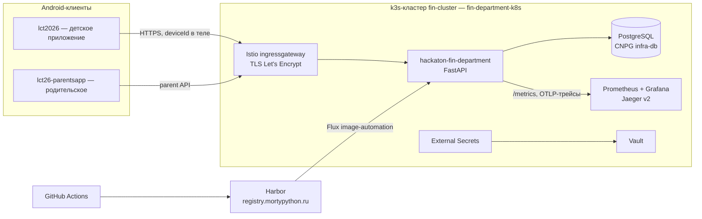

# «Лапки и монеты»

«Лапки и монеты» — мобильная игра, которая в игровой форме учит детей
обращаться с деньгами. Ребёнок выбирает себе питомца-спутника и вместе с ним
проходит историю из пяти глав: зарабатывает монеты, планирует бюджет,
откладывает деньги на большую цель и на собственном опыте видит последствия
своих финансовых решений. Родитель при этом видит, какие финансовые навыки у
ребёнка уже получаются, а где нужна помощь — и получает подсказки, как
обсудить это с ребёнком.

Игра полностью работает без интернета: весь прогресс хранится на устройстве.
Сеть нужна только для облачной копии сохранения, родительского отчёта и
обновлений.

## Содержание

- [Что это за проект](#что-это-за-проект)
  - [Из чего состоит проект](#из-чего-состоит-проект)
  - [Как играет ребёнок](#как-играет-ребёнок)
  - [Что видит родитель](#что-видит-родитель)
- [Что где находится: ссылки на решения](#что-где-находится-ссылки-на-решения)
- [Правила игры: как играть и как показать игру](#правила-игры-как-играть-и-как-показать-игру)
  - [В чём смысл игры](#в-чём-смысл-игры)
  - [Первый запуск](#первый-запуск)
  - [Что где находится на главном экране](#что-где-находится-на-главном-экране)
  - [Как проходит обычный день](#как-проходит-обычный-день)
  - [Деньги, бюджет и копилка](#деньги-бюджет-и-копилка)
  - [Где зарабатывать и как играть в мини-игры](#где-зарабатывать-и-как-играть-в-мини-игры)
  - [Еда, силы и настроение](#еда-силы-и-настроение)
  - [Как выполнить большую цель и перейти в следующую главу](#как-выполнить-большую-цель-и-перейти-в-следующую-главу)
  - [Дополнительные возможности](#дополнительные-возможности)
  - [Что происходит в финале](#что-происходит-в-финале)
  - [Настройки](#настройки)
  - [Родительская часть](#родительская-часть-на-игровом-телефоне-и-в-отдельном-приложении)
  - [Как показать игру жюри](#как-показать-игру-жюри)
  - [Если игра «не идёт дальше»](#если-непонятно-почему-игра-не-идёт-дальше)
- [Архитектура приложения](#архитектура-приложения)
  - [Общая схема](#общая-схема)
  - [lct2026 — детское приложение](#lct2026--детское-приложение)
  - [lct26-parentsapp — родительское приложение](#lct26-parentsapp--родительское-приложение)
  - [hackaton-fin-department — HTTP-бэкенд](#hackaton-fin-department--http-бэкенд)
  - [fin-department-k8s — GitOps-инфраструктура](#fin-department-k8s--gitops-инфраструктура)
  - [CI/CD и наблюдаемость](#cicd-и-наблюдаемость)
- [Быстрый старт](#быстрый-старт)

## Что это за проект

Игра отвечает на простой вопрос: как научить ребёнка разумно обращаться с
деньгами, если объяснять «на пальцах» скучно? Вместо лекций — живая история:
у ребёнка есть питомец, которого нужно кормить и развлекать, и большая мечта,
на которую нужно копить. Каждый игровой день — это небольшие финансовые
решения: потратить или отложить, купить желание или сэкономить, выполнить
работу самому или заплатить за услугу. Ошибки не наказываются, а становятся
опытом: игра показывает, к чему привело решение, и даже предлагает посмотреть,
«а что было бы, если бы поступил иначе».

### Из чего состоит проект

Проект — это комплекс из четырёх частей:

1. **Детская игра** (этот репозиторий, `lct2026`) — Android-приложение,
   в котором играет ребёнок: питомец, экономика, сюжет из пяти глав,
   мини-игры и встроенная родительская часть.
2. **Родительское приложение** (`lct26-parentsapp`) — отдельное
   Android-приложение для телефона родителя: подключается к игре ребёнка по
   QR-коду и показывает отчёт о развитии финансовых навыков.
3. **Сервер** (`hackaton-fin-department`) — хранит облачную копию
   сохранения игры, принимает статистику решений и считает оценки навыков,
   передаёт подарки от родителя ребёнку и материалы для родительских отчётов.
4. **Инфраструктура** (`fin-department-k8s`) — описание того, где и как
   работает сервер. Обновления сервера выкладываются автоматически, без
   ручных действий.

Адрес сервера — `https://fin-api.mortypython.ru`. Игра не требует регистрации:
устройство узнаётся по внутреннему номеру, ребёнку ничего вводить не нужно.

### Как играет ребёнок

- Ребёнок выбирает спутника (лисёнка, сову или аксолотля), придумывает ему имя,
  характер и внешность.
- Каждый игровой день приносит события с выбором: помочь, купить, пройти мимо
  или выполнить работу самому. У каждого выбора есть цена — деньги, время
  и силы героя.
- Все деньги делятся на четыре части бюджета: **«Нужно»** (еда и необходимое),
  **«Хочу»** (удовольствия), **«В копилку»** (накопления на большую цель)
  и **«Запас»** (на неожиданности).
- Заработать монеты можно на поручениях и мини-играх: найти пару карточек,
  сравнить цены, поймать маркер в зелёную зону и другие.
- В каждой главе есть большая цель (например, «Ночь наблюдений»: карта звёзд,
  штатив, телескоп и поездка). Чтобы её выполнить, нужно купить весь комплект —
  и для этого действительно откладывать деньги, а не только планировать.
- Герой устаёт и голодает: его нужно кормить и давать отдых. Это тоже
  финансовые решения — обеды стоят по-разному и дают разный эффект.
- Прогресс сохраняется автоматически, отдельной кнопки сохранения нет.

### Что видит родитель

Родительский отчёт показывает, как ребёнок осваивает конкретные финансовые
навыки: планирование бюджета, накопление на цель, сравнение цен, учёт
последствий покупок и другие. По каждому навыку — статус: **«Освоен»**,
**«Тренируется»**, **«Есть трудности»** или **«Недостаточно данных
для оценки»**. К навыку прилагаются материалы для разговора с ребёнком:
вопросы, жизненные истории и примеры.

Открыть отчёт можно двумя способами:

- **на телефоне ребёнка** — долгое нажатие на шестерёнку в главном меню,
  затем PIN-код (родительский режим встроен в игру);
- **на телефоне родителя** — отдельное родительское приложение, связанное
  с игрой по QR-коду; данные приходят с сервера.

Действия в демонстрационном «режиме бога» не учитываются как свидетельства
навыков — оценки строятся только по обычной игре.

## Что где находится: ссылки на решения

Быстрая навигация по материалам проекта: где что лежит и куда смотреть.

| Материал | Где находится |
| --- | --- |
| Исследование рынка, конкурентов и научных работ, анализ и выводы | [FigJam «2026 фин. питомец»](https://www.figma.com/board/mlTEA1hlLJPYf1yRX5a739/2026-%D1%84%D0%B8%D0%BD-%D0%BF%D0%B8%D1%82%D0%BE%D0%BC%D0%B5%D1%86?node-id=0-1&t=cFvpQiBzQnoTnrZO-1) |
| Прототип дизайна и роадмап | [Figma «Питомец. Дизайн»](https://www.figma.com/design/bAod1cKtTX9Q8omQ067q3q/%D0%9F%D0%B8%D1%82%D0%BE%D0%BC%D0%B5%D1%86-%D0%94%D0%B8%D0%B7%D0%B0%D0%B9%D0%BD?node-id=2863-2&t=BocgvuyNLHtf6SWk-1) |
| Сборка основного приложения (APK) | [Google Drive, папка «Лцт 2026»](https://drive.google.com/drive/folders/1HkfSwS1XoJB-eHxlJwF0qJw_2d_R331Y) |
| Сборка родительского приложения (APK) | [Google Drive, папка «Лцт 2026»](https://drive.google.com/drive/folders/1HkfSwS1XoJB-eHxlJwF0qJw_2d_R331Y) |
| Презентация проекта | [Google Drive, папка «Лцт 2026»](https://drive.google.com/drive/folders/1HkfSwS1XoJB-eHxlJwF0qJw_2d_R331Y) |
| Дашборды с метриками | [Grafana](https://grafana.mortypython.ru/) — логин `userlct`, пароль `userlct` |
| Аудио-пак (озвучка событий, эффекты оплаты и покупок) | [Google Drive](https://drive.google.com/drive/folders/1LEU5RhyiwvKXKCfZvLElC2FSSrU9Jkkp?usp=sharing) |
| Гайд и каталог арт-ассетов | [docs/design/assets/README.md](docs/design/assets/README.md), [catalog.md](docs/design/assets/catalog.md) |
| Код проекта (четыре репозитория) | см. [Репозитории](#репозитории) ниже |

Дашборды Grafana:

- [Игровая аналитика](https://grafana.mortypython.ru/d/game-analytics/igrovaja-analitika?orgId=1&from=now-24h&to=now&timezone=browser&refresh=1m) —
  как играют дети: события, покупки, навыки;
- [Метрики кластера](https://grafana.mortypython.ru/d/7d57716318ee0dddbac5a7f451fb7753/node-exporter-nodes?orgId=1&from=now-1h&to=now&timezone=utc&var-datasource=prometheus&var-cluster=%24__all&var-instance=77.91.112.72:9100&refresh=30s) —
  состояние сервера: нагрузка, память, сеть.

Шпаргалка по демонстрации:

- Бесплатные предметы и бесконечные силы для быстрого показа — включить
  **«Режим бога»** в настройках игры (см. [Настройки](#настройки)).
- Родительский режим — **долгое нажатие на шестерёнку** в главном меню игры
  либо отдельное родительское приложение (см.
  [Родительская часть](#родительская-часть-на-игровом-телефоне-и-в-отдельном-приложении)).

## Правила игры: как играть и как показать игру

Инструкция для текущей версии приложения, 29 сентября 2026 года.

**Родительская часть доступна двумя способами.** На телефоне с игрой нажми
и удерживай шестерёнку в главном меню, затем введи родительский PIN. На своём
телефоне родитель может открыть отдельное родительское приложение и
подключить игру, отсканировав QR из её настроек. Пошагово оба способа
описаны ниже.

### В чём смысл игры

Ты выбираешь спутника и вместе с ним проходишь историю Смотрителей. Чтобы
двигаться дальше, нужно готовиться к большим приключениям: зарабатывать,
покупать снаряжение, откладывать деньги и заботиться о герое.

Первая большая цель - «Ночь наблюдений». Для неё нужны карта звёзд, штатив,
телескоп и поездка. Купить всё сразу не получится в обычном режиме: придётся
выбирать, сколько оставить на еду, сколько отложить и стоит ли тратить деньги
на необязательную покупку.

У игры пять глав. По мере прохождения герой взрослеет: в первой главе он
ребёнок, во второй и третьей - подросток, в четвёртой - взрослый, в пятой -
старик. Покупки помогают выполнить цель главы, а сюжет объясняет, зачем были
нужны эти вещи.

### Первый запуск

1. Нажми на лисёнка, затем на **«Начать приключение»**. Сова и аксолотль пока
   недоступны.
2. Посмотри вступительный ролик. Если уже видел его, нажми **«Пропустить»**.
3. Придумай имя спутнику, выбери характер и цвет шерсти. Нажми
   **«Продолжить»**.
4. Выбери аксессуар и нажми **«Применить»**.
5. Прочитай задание Смотрителей и нажми **«Дальше»**.
6. Выбери, на какую часть снаряжения копить сначала, и нажми
   **«Начать с этого»**. Это первая покупка внутри общей цели, а не выбор
   другой главы.
7. Перейди к распределению денег по кнопке **«Распределить монеты»**.
8. Распредели все 100 монет. Для первого знакомства подойдёт: 35 на нужное,
   20 на желания, 40 в план накоплений и 5 в запас. Нажми **«Запомнить план»**.

После этого откроется главный экран. Здесь можно играть дальше и открыть
настройки.

### Что где находится на главном экране

| Что нажать | Что откроется |
| --- | --- |
| Цель вверху экрана или **«Цель»** внизу | Список необходимых вещей, цены и уже купленные части |
| **«Монетки»** | Доступные деньги, настоящая копилка и распределение бюджета; отсюда открываются бюджет, копилка и история |
| **«Дела»** | Доступные поручения с наградами и отдельная тренировка финансовых навыков |
| **«Снаряжение»** | Купленные вещи и аксессуары |
| Рисунок карты | Карта мира и доступные места |
| Имя питомца | Изменение имени |
| Шестерёнка | Настройки; для родительского режима её нужно нажать и удерживать |
| Большая кнопка внизу | Следующий шаг игры |

Надпись на большой кнопке меняется по ситуации. **«Продолжить день»**
открывает следующее событие, **«Вернуться к событию»** возвращает к уже
начатому, **«Закончить день»** завершает день, **«Итоги дня»** открывает
результаты. Когда всё снаряжение собрано, появляется **«Выполнить цель»**.

Если карточка длинная, прокрути её до кнопок. Карту тоже можно прокручивать:
проведи пальцем вверх или вниз. Стрелки подсказывают, где есть продолжение;
это подсказки, а не кнопки.

### Как проходит обычный день

1. Нажми **«Продолжить день»**.
2. Прочитай событие и выбери действие. Например, помочь Смотрителю, купить
   вещь, пройти мимо или сделать работу самостоятельно.
3. Обрати внимание на цену и усталость. Иногда можно заплатить и сохранить
   силы, а иногда - выполнить работу самому и сберечь деньги.
4. Если начинается мини-игра, выполни её задание. После завершения посмотри
   результат и продолжи приключение.
5. Если герой проголодался, нажми **«Покормить»** и выбери обед. Если устал,
   закончи день и отдохни.
6. В конце посмотри итоги: что произошло, сколько заработали и потратили.
   Нажми **«Начать день …»**, чтобы перейти дальше.

Необязательную покупку можно отклонить. **«Вернуться позже»** у незавершённого
дела означает, что оно остаётся на потом: проблема сама не решается.

Прогресс сохраняется автоматически. Отдельной кнопки сохранения нет.

### Деньги, бюджет и копилка

**«Доступно»** - деньги, которыми можно распоряжаться сейчас. **«В копилке»** -
уже отложенные накопления.

В бюджете четыре части:

- **«Нужно»** - еда и необходимые расходы.
- **«Хочу»** - покупки для удовольствия.
- **«В копилку»** - сумма, которую собираешься отложить на большую цель.
- **«Запас»** - деньги на неожиданности.

Запомнить план и положить деньги в копилку - два разных действия. Например,
запись «40 в копилку» в бюджете ещё не означает, что там уже лежат 40 монет.

Чтобы действительно отложить деньги, открой **«Монетки» → «Открыть копилку» →
«Пополнить»**, укажи сумму и нажми кнопку **«Отложить …»**. Здесь же можно
перейти к снятию и вернуть часть накоплений в доступные деньги, подтвердив
действие.

План можно менять через **«Монетки» → «Открыть бюджет»**. Распредели текущие
деньги и сохрани изменения. Если игра спрашивает причину, выбери ту, которая
соответствует твоему решению.

Предметы большой цели можно оплачивать накоплениями, а при необходимости
дополнять их доступными деньгами. Перед подтверждением игра показывает,
откуда возьмёт сумму. Если после покупки может не хватить на еду, появится
отдельное предупреждение.

### Где зарабатывать и как играть в мини-игры

Открой **«Дела»**, выбери поручение и нажми **«Взяться за дело»**. У дела
указаны награда, затраты сил и срок. Если список пуст, продолжи день: новые
предложения появляются по ходу приключения.

Показанная награда «до …» - максимальная. Ошибки могут уменьшать итоговую
выплату; в денежных заданиях это видно по индикатору награды. Некоторые игры
нужны для сюжета или отдыха, а не для заработка.

| Мини-игра | Что делать |
| --- | --- |
| Найди пару | Открывай по две карточки и находи одинаковые предметы. Первое знакомство с неизвестными карточками не считается забыванием пары |
| Сравнение цен | Выбирай более дорогой предмет. После ответа нажимай **«Дальше»**, в конце - **«Завершить»** |
| Точность | Нажми **«Стоп!»**, когда маркер окажется в зелёной зоне |
| Сигналы | Дождись окончания вспышек и нажми на лампы в том же порядке. В новой партии три раунда |
| Фонари | Нажимай на фонари, чтобы погасить их все. Каждое нажатие меняет выбранный фонарь и соседние |
| Соединение концов | Нажми на цветной конец и последовательно нажимай соседние клетки до второго конца того же цвета. Не пересекай чужие линии |
| Поиск отличий | Сравни две полки и нажимай на отличия на нижней |
| Ящики | Нажми **«Опустить ящик»**, когда движущийся ящик находится над предыдущим |

Если дело не начинается, прочитай сообщение: может требоваться еда, отдых или
завершение уже открытого события. Кнопка **«Вернуться к событию»** помогает
продолжить начатое.

### Еда, силы и настроение

Когда появляется **«Покормить»**, можно выбрать:

- **Обычный обед за 5 монет** - утолит голод.
- **Роскошный обед за 7 монет** - утолит голод, поднимет настроение
  и восстановит немного сил.
- **Праздничный обед за 10 монет** - утолит голод, поднимет настроение
  и восстановит больше сил.

Поесть можно один раз за игровой день. Улучшенный обед восстанавливает
потраченные силы, но не увеличивает их обычный максимум. Бесплатная столовая,
когда она доступна, позволяет поесть без денег, но после неё нужен отдых и на
следующее утро сил будет меньше.

Кольцеброс нужен для отдыха: завершение игры радует героя и восстанавливает
немного потраченных сил. Денежного приза за него нет.

### Как выполнить большую цель и перейти в следующую главу

Открой **«Цель»**. Для первой главы нужно купить все четыре части: карту
звёзд, штатив, телескоп и поездку. Выбранная цель накопления помогает решить,
что покупать следующим, но одного предмета для завершения главы недостаточно.

У нужной части нажми **«Выбрать цель»**, затем **«Купить за …»** и подтверди
кнопкой **«Купить»**. Если она уже выбрана, сразу переходи к покупке. После
покупки нажми **«К целям»** и выбери следующую недостающую часть.

Когда весь комплект куплен, нажми **«Выполнить цель»**. Оставшийся сюжет
главы пойдёт быстрее, без очереди новых необязательных бытовых событий. Уже
начатое событие нужно закончить; сюжетные задания и важные выборы остаются.

Перед финалом может открыться короткий финансовый разбор. Нажми
**«Начать разбор»**, выбери ответ и нажми **«Ответить»**. При ошибке прочитай
объяснение и попробуй ещё раз. Если остался ещё вопрос, нажми
**«Следующий вопрос»**. В конце нажми **«Продолжить историю»**. Это конечный
разбор, его не нужно проходить бесконечно.

В следующей главе появится новая большая цель и вернётся обычный темп
событий. Купленные вещи останутся в снаряжении.

### Дополнительные возможности

**Снаряжение.** Нажми **«Рассмотреть»** под нужной вещью, чтобы открыть её
страницу. У некоторых предметов есть дополнительные иллюстрации и сведения.
Доступные аксессуары можно надевать на героя.

**Тренировка навыков.** Открой **«Дела» → «Тренировка навыков»** и выбери
тему: план и траты, последствия решений, доходы и расходы или накопления.
Выбери ответ и нажми **«Ответить»**. Это свободная тренировка: вопросы
продолжаются, пока сам не выйдешь. Монеты за неё не начисляются.

**«А что, если…».** В итогах дня это предложение появляется, если есть
подходящее решение для сравнения. Выбери событие и другой вариант поступка.
Игра покажет, что могло бы измениться, и предложит вопрос. Настоящие деньги,
вещи и пройденный сюжет от этого не меняются.

**История.** Открой **«Монетки» → «История приключения»**, чтобы посмотреть
события, покупки и движение денег. После завершённого прохождения здесь
доступен пункт **«Прошлые приключения»**.

### Что происходит в финале

После последней главы герой узнаёт, что раскрыл лишь часть секретов и может
попробовать другой путь. Нажми **«Воспользоваться силой»**.

Текущее приключение сохранится в истории, а игра вернётся к выбору спутника.
Начнётся новое прохождение со своим бюджетом и покупками; прежние деньги
и снаряжение в него не переносятся. В нынешней версии повторяется тот же круг
истории; новые персонажи со своими сюжетами пока не добавлены.

### Настройки

Нажми на шестерёнку в главном меню. Страницу настроек можно прокручивать.

| Настройка или кнопка | Что делает |
| --- | --- |
| **«Звук»** | Включает и выключает музыку, голоса, звуки событий и видео. При сворачивании приложения звук приостанавливается |
| **«Режим бога»** | Включает быстрое прохождение: герой не устаёт, предметы и еда бесплатны, мини-игры и обязательный разбор можно пропускать |
| **«Скачать журнал»** | Сохраняет текстовый журнал для разбора ошибок. Выбери место сохранения и затем передай файл разработчикам |
| **«Показать код для родителей»** | Показывает QR для подключения отдельного родительского приложения. Его можно отправить кнопкой **«Поделиться QR-кодом»** |
| **«Скопировать номер»** | Копирует номер устройства, по которому связана игра |
| **«Синхронизировать сейчас»** | Запускает обмен с сервером; нужен интернет |
| **«Загрузить копию из облака»** | Показывает доступное облачное сохранение. Текущая игра заменится только после **«Восстановить эту игру»**. Чтобы ничего не менять, нажми **«Оставить текущую игру»** |

Режим бога по умолчанию выключен. Если ты включил его сам, настройка
сохранится. После выключения полученные вещи и пройденная история останутся.
Голод в этом режиме сохраняется, поэтому **«Покормить»** иногда всё равно
нужно нажимать; еда будет бесплатной. Отдельные услуги и развлечения могут
по-прежнему стоить денег.

В отладочной сборке есть **«Инструменты разработчика» → «Сбросить прогресс
и перезапустить»**. Этот сброс удаляет прогресс. Для сюжетного возвращения
к началу с сохранением истории используется **«Воспользоваться силой»**
в финале.

Если появится предложение обновления RuStore, **«Позже»** позволит продолжить
игру. **«Установить»** установит подготовленное обновление и перезапустит
приложение.

### Родительская часть: на игровом телефоне и в отдельном приложении

#### На телефоне с игрой: долгое нажатие на шестерёнку

Это встроенный родительский режим. Его можно показать на том же телефоне,
на котором играет ребёнок.

1. Вернись на главный экран с питомцем.
2. **Нажми на шестерёнку и держи палец, пока не откроется экран PIN-кода.**
   Это долгое нажатие, или лонг-тап. Короткое нажатие открывает обычные
   настройки.
3. При первом входе придумай четырёхзначный PIN-код и повтори его. При
   следующих входах введи тот же код.
4. Откроется отчёт текущей игры: деньги, накопления, финансовые навыки
   и наблюдения за решениями игрока.
5. С интернетом оценки обновляются при входе. Для повторного запроса нажми
   **«Обновить оценки»**.
6. Нажми на интересующий навык. Посмотри, какие были успешные применения
   и где возникали трудности.
7. Для возвращения нажми **«В игру»**. После сворачивания родительской части
   PIN потребуется снова.

Идея отчёта - связать конкретные поступки с финансовыми навыками. Например,
как ребёнок распределяет деньги, откладывает на цель, сравнивает цены
и учитывает последствия покупки. Родитель видит статусы **«Освоен»**,
**«Тренируется»**, **«Есть трудности»** или **«Недостаточно данных для
оценки»**. Отсутствие оценки не означает, что ребёнок не умеет этого делать.

В карточке навыка предусмотрены материалы для разговора: вопросы, жизненные
истории и предложение родителю вспомнить собственный пример. Их смысл -
помочь обсудить трудную тему, а не просто показать оценку. Тексты появляются
после публикации на сервере; если их ещё нет, приложение сообщает об этом.
Для повторной загрузки есть **«Обновить материалы»**.

Кнопка **«Создать квест»** пока открывает раздел в разработке. Готовое
создание домашних заданий через неё сейчас не показываем. QR из обычных
настроек для входа в этот встроенный отчёт не нужен.

#### На телефоне родителя: отдельное приложение и QR-код

Отдельное родительское приложение позволяет смотреть прогресс на своём
телефоне. Сначала его нужно связать с игрой ребёнка.

1. **На телефоне ребёнка:** открой игру и коротко нажми на шестерёнку, чтобы
   попасть в **«Настройки»**.
2. Найди блок **«Для родителей»** и нажми **«Показать код для родителей»**.
   На экране появится QR-код этой игры.
3. **На телефоне родителя:** открой отдельное родительское приложение
   и его сканер QR-кода.
4. Наведи камеру на QR-код, который показан на игровом телефоне. Для этого
   используй сканер внутри родительского приложения.
5. После подключения открой отчёт в родительском приложении. Данные игры
   поступают через сервер, поэтому для получения актуального прогресса нужен
   интернет.

Если код нужно передать отдельно, в игре нажми **«Поделиться QR-кодом»**.
Сам показ кода ещё не означает, что подключение завершилось: при сообщении
об ошибке регистрации нажми **«Повторить подключение»**. Чтобы отправить
актуальные данные игры, в настройках есть **«Синхронизировать сейчас»**.

Для быстрого входа на одном телефоне используй **долгое нажатие на
шестерёнку → PIN**. Для подключения телефона родителя используй **обычное
нажатие → настройки → QR-код → сканер отдельного приложения**.

### Как показать игру жюри

#### Подготовка перед выступлением

Заранее пройди первое знакомство и несколько действий в обычном режиме:
составь бюджет, отложи деньги, выполни дело и сделай покупку. Открой
родительскую часть, создай PIN и проверь, что с интернетом получены оценки.

Для показа отдельного родительского приложения подготовь второй телефон,
открой на нём приложение и заранее проверь подключение через QR-код.
На выступлении можно повторить сам путь подключения, а затем показать уже
загруженный отчёт.

Это важно: действия в режиме бога не используются как свидетельства
финансовых навыков. Если всё прохождение было демонстрационным, новые оценки
по нему обещать нельзя. Для показа родительской части лучше иметь заранее
сыгранные обычные эпизоды.

До выступления проверь, опубликованы ли вопросы для родителей. Если экран
пишет, что материалов ещё нет, покажи отчёт и объясни назначение вопросов
словами.

#### Основной показ, примерно 5-7 минут

1. **Главный экран и цель.** Открой **«Цель»** и покажи «Ночь наблюдений»
   с четырьмя покупками. Объясни: ребёнок собирает снаряжение для приключения
   и выбирает, на что тратить ограниченные деньги.
2. **Планирование.** Вернись и открой **«Монетки» → «Открыть бюджет»**.
   Покажи четыре части бюджета. Затем открой копилку и покажи, что
   запланировать накопления и действительно отложить деньги - разные действия.
3. **Один игровой эпизод.** Открой **«Дела»** или продолжи текущее событие.
   Покажи выбор, его цену и одну мини-игру. Не нужно проходить все виды игр
   подряд.
4. **Родительский результат.** Покажи два способа доступа. На игровом телефоне
   вернись в меню, **нажми и удерживай шестерёнку**, введи PIN и открой один
   навык в отчёте. Затем вернись в игру, коротко нажми шестерёнку и выбери
   **«Показать код для родителей»**. На втором телефоне открой сканер
   отдельного родительского приложения, отсканируй код и покажи отчёт.
   Объясни: «Родитель может посмотреть прогресс прямо в игре через PIN или
   в своём приложении на другом телефоне». Свяжи наблюдение с игровой
   механикой: «Здесь видно, с чем ребёнок справляется и что стоит обсудить».
   Если материалы опубликованы, открой вопросы и пример жизненной истории.
   Если второго телефона нет, покажи QR и встроенный отчёт.
5. **Быстрый переход по сюжету.** Вернись в игру. Коротко нажми шестерёнку
   и включи **«Режим бога»**. Вернись в **«Цель»** и нажми
   **«Получить бесплатно» → «Получить»**. Затем **«К целям»**, выбери
   следующую недостающую часть, нажми **«Выбрать цель»** и получи её так же.
   Когда комплект собран, нажми **«Выполнить цель»**.
6. **Финал главы.** Продолжай сюжетные карточки. Если открылась мини-игра,
   сверху нажми **«Пропустить игру»**. Если появился обязательный разбор,
   нажми **«Пропустить разбор»**. Покажи выполнение цели и начало следующей
   главы.

Если времени мало, достаточно цели, одного финансового выбора, одной
мини-игры и родительского отчёта. Для этого не нужно проходить все пять глав.

#### Если нужно показать весь круг истории

После основного показа оставь режим бога включённым. В каждой следующей главе
получай её комплект, нажимай **«Выполнить цель»**, проходи сюжетные карточки
и пропускай игры или разбор по соответствующим кнопкам. Если герой голоден,
покорми его бесплатным обедом.

В пятой главе покажи последнюю карточку и нажми **«Воспользоваться силой»**.
Игра вернётся к выбору спутника, а завершённое приключение останется
в архиве.

На этом показ можно закончить. Если после демонстрации хочешь продолжать
обычную игру, выключи режим бога вручную.

### Если непонятно, почему игра не идёт дальше

- **Нет новых дел:** продолжи день, чтобы получить предложения.
- **Нельзя начать дело:** прочитай причину; покорми героя, отдохни или
  вернись к текущему событию.
- **Куплен один предмет, но глава не закончилась:** нужен весь комплект
  и завершение сюжета.
- **Всё куплено, но открывается ещё одна карточка:** это оставшаяся часть
  истории или уже начатое событие; продолжай к выполнению цели.
- **В тренировке всё идут вопросы:** свободная тренировка продолжается до
  выхода. Она отличается от короткого обязательного разбора перед финалом
  главы.
- **Нет оценки в родительском отчёте:** проверь интернет, нажми
  **«Обновить оценки»** и убедись, что в прохождении были обычные, а не
  только демонстрационные действия.
- **Произошёл вылет или зависание:** после возвращения в приложение открой
  **«Настройки» → «Скачать журнал»**. Передай файл и напиши, какую кнопку
  нажал перед ошибкой.

## Репозитории

| Репозиторий | Что это |
| --- | --- |
| [lct2026](https://github.com/salyamii/lct2026) | Детское Android-приложение (основная игра) — этот репозиторий |
| [lct26-parentsapp](https://github.com/HighlyLoadedEgo/lct26-parentsapp) | Родительское Android-приложение-компаньон |
| [hackaton-fin-department](https://github.com/OptikRUS/hackaton-fin-department) | HTTP-бэкенд: профиль устройства, облачные снапшоты, аналитика, награды |
| [fin-department-k8s](https://github.com/HighlyLoadedEgo/fin-department-k8s) | GitOps (Flux) для single-node k3s-кластера, где живёт бэкенд |

## Архитектура приложения

### Общая схема



Публичный адрес бэкенда — `https://fin-api.mortypython.ru`. Авторизации в
контракте v1 нет: профиль клиента определяется строкой `deviceId` (ANDROID_ID),
которую Android передаёт в теле каждого запроса (см.
[docs/backend/README.md](docs/backend/README.md)).

### lct2026 — детское приложение

Нативное Android-приложение: офлайн-first игра с питомцем, внутриигровой
экономикой, сюжетом и развитием финансовых навыков ребёнка. Локально — Room
как источник текущего мира; облако — бэкап/рестор снапшота, передача фактов
и навыков, доставка родительских наград.

**Стек:** Kotlin, Jetpack Compose, Material 3, Navigation 3, усиленный MVVM
(UDF, immutable `UiState` в `StateFlow`, явные UI-действия), Hilt, Room,
Preferences DataStore, Retrofit + OkHttp + Kotlinx Serialization, WorkManager
(долгоживущие фоновые загрузки/ретраи), JUnit 4 + Compose UI-тесты.

**Структура:**

- `:core:game` — чистый Kotlin-домен: игровой агрегат, команды, правила,
  контент, история, финансовые проекции, контракты снапшотов и бэкенда;
- `:app` — композиция, Hilt-граф, навигация, Room, установка контента,
  транспорт к бэкенду (`data/backend`), identity устройства (`deviceId`);
- `:feature:onboarding`, `:feature:debug` — отдельные Gradle-модули UI;
- `:feature:parents` — родительский режим: PIN-гейт, локальные свидетельства
  и серверные оценки навыков (родительская функциональность адаптирована
  из `lct26-parentsapp`, открывается долгим нажатием на шестерёнку);
- `docs/` — архитектура, навигация, контракт с бэкендом (`docs/backend/`)
  со схемами OpenAPI и генератором проверенных примеров.

Ключевые правила: одна игровая единица записи коммитится атомарно
(питомец + экономика + сюжет), UI не знает про навигационные объекты,
домен не зависит от Android. Подробности — [docs/architecture.md](docs/architecture.md).

### lct26-parentsapp — родительское приложение

Приложение-компаньон для родителей на том же стеке (Kotlin + Jetpack Compose +
Material 3, MVVM): родитель видит, как ребёнок осваивает финансовые навыки —
отчёт по навыкам с серверными статусами `MASTERED`/`PRACTICING`/`NO_DATA`/
`HAS_PROBLEM`, доступ защищён PIN-кодом. Профиль ребёнка открывается по QR
(строка `deviceId`), данные читаются с бэкенда по родительскому API.
Его наработки (PIN-гейт, отчёт по навыкам) легли в основу `:feature:parents`
внутри `lct2026`, где родительский режим встроен прямо в игру.

**Стек:** Kotlin, Jetpack Compose, Material 3, Hilt, Room, Navigation 3.

### hackaton-fin-department — HTTP-бэкенд

Единый бэкенд для обоих приложений. Хранит профиль устройства и питомца,
принимает и отдаёт полный архив мира (world snapshot), принимает факты
геймплея и считает оценки навыков, доставляет родительские награды и отдаёт
родительский отчёт (пока демонстрационная заглушка). Живёт в кластере на
`fin-api.mortypython.ru`.

**Стек:** Python 3.14, FastAPI, Dishka (DI), SQLAlchemy, PostgreSQL
(миграции через `make migrate`), OpenTelemetry (OTLP gRPC трейсы → Jaeger,
метрики Prometheus через `GET /metrics`), uv, Ruff, mypy, pytest + behave
(BDD), Docker Compose для локальной разработки.

**Структура `src/`:** `core/` (домен: `pets`, `profiles`, `snapshots`,
`analytics`, `rewards`), `infra/` (API, storages, migrations, observability),
`di/`, `config/`, `tests/` (включая BDD).

**Ключевые методы мобильного API:**

| Метод | Путь | Назначение |
| --- | --- | --- |
| `POST` | `/api/pets` | Регистрация `deviceId` и питомца |
| `PUT` | `/v1/profiles/snapshot` | Загрузка полного архива мира |
| `POST` | `/v1/profiles/snapshot/download` | Получение последнего архива |
| `POST` | `/v1/profiles/analytics` | Передача фактов и навыков |
| `POST` | `/v1/profiles/skills/query` | Оценки навыков (`MASTERED`/`PRACTICING`/`NO_DATA`/`HAS_PROBLEM`) |
| `POST` | `/v1/profiles/rewards/pull` | Получение подарков |
| `POST` | `/v1/profiles/rewards/ack` | Подтверждение применения подарков |
| `POST` | `/v1/parent-profiles/rewards` | Выдача подарка родителем |
| `GET` | `/api/parents/{petId}` | Родительский отчёт (заглушка) |

Все записи идемпотентны через `Idempotency-Key`; конфликты ревизий снапшота и
журнала прохождений дают `409`. Контракт описан в
[docs/backend/README.md](docs/backend/README.md) этого репозитория и
`docs/mobile-contract.md` бэкенда.

### fin-department-k8s — GitOps-инфраструктура

Манифесты (без исходников) single-node k3s-кластера `fin-cluster`: домен
`mortypython.ru`, VIP `77.91.112.72`, storage Longhorn (50GB SSD). Цепочка
синка Flux: `flux-system → infrastructure-crds → infrastructure → apps`
с `wait: true`.

**Стек:** Flux CD (Kustomization, HelmRelease, image-automation), k3s, Istio
(ingressgateway + TLS), MetalLB, Longhorn, CloudNativePG + barman-cloud
(бэкапы PostgreSQL → Yandex S3), Harbor (registry, PG на `infra-db`),
HashiCorp Vault + External Secrets Operator, kube-prometheus-stack + Grafana,
Jaeger v2 (badger, TTL 7d), OTel Operator, cert-manager (Let's Encrypt
HTTP-01), Headlamp и Weave GitOps для UI.

**Как устроено:**

- секреты только через цепочку `Vault → ClusterSecretStore → ExternalSecret`,
  в git секретов нет;
- базы создаются CR `Database` (`harbor-db`, `hackaton-fin-db`) в кластере
  `infra-db`;
- приоритеты подов: `fin-critical` (Vault, CNPG) > `fin-platform`
  (gateway и платформа) > `fin-apps` > `fin-batch`;
- трафик: интернет → VIP (externalIPs) → istio ingressgateway →
  VirtualService по хосту → Service приложения.

### CI/CD и наблюдаемость

Пайплайн бэкенда без ручных шагов:

```
PR в main (hackaton-fin-department)
  → GitHub Actions: ruff / mypy / pytest+behave (Postgres 17 в service-контейнере)
  → merge: сборка и push образа в Harbor
    registry.mortypython.ru/fin/hackaton-fin-department:main-<UTC ts14>-<sha12>
  → Flux ImageRepository/ImagePolicy выбирает свежий main-тег
  → ImageUpdateAutomation коммитит тег в fin-department-k8s
  → Flux перекатывает Deployment (миграции — initContainer `make migrate`)
```

Наблюдаемость в кластере: метрики приложений `/metrics` (OTel SDK + Prometheus
reader) собирает PodMonitor; алерты — PrometheusRule → Grafana Alerting;
трейсы — Jaeger: от Istio (sampling 5%, zipkin `:9411`) и от приложений
(OTLP gRPC `:4317`). Недоступный коллектор приложениям не мешает — экспортёр
только логирует ошибки.

## Быстрый старт

Детское приложение:

```bash
./gradlew :app:assembleDebug
./gradlew :app:testDebugUnitTest :app:assembleDebug :app:lintDebug
```

Бэкенд локально:

```bash
uv sync --frozen
uv run python -m src.main   # 127.0.0.1:8080, Swagger — /docs
```
