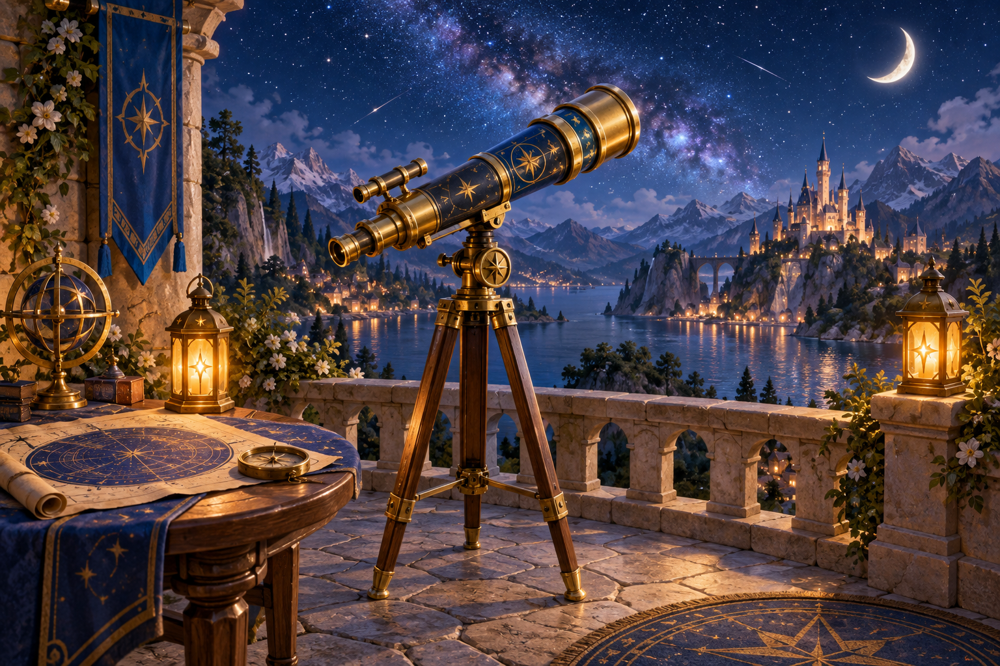
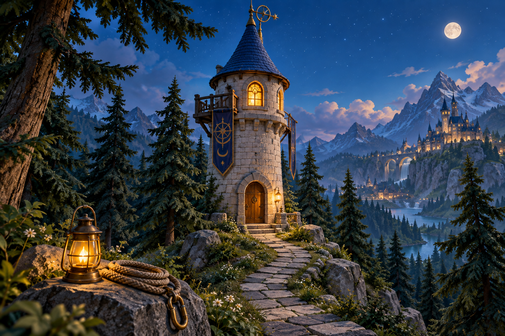
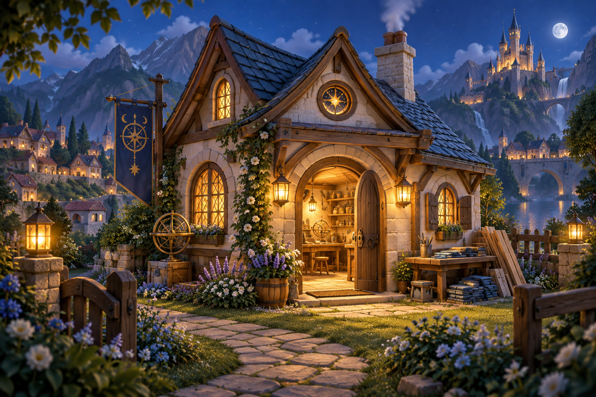
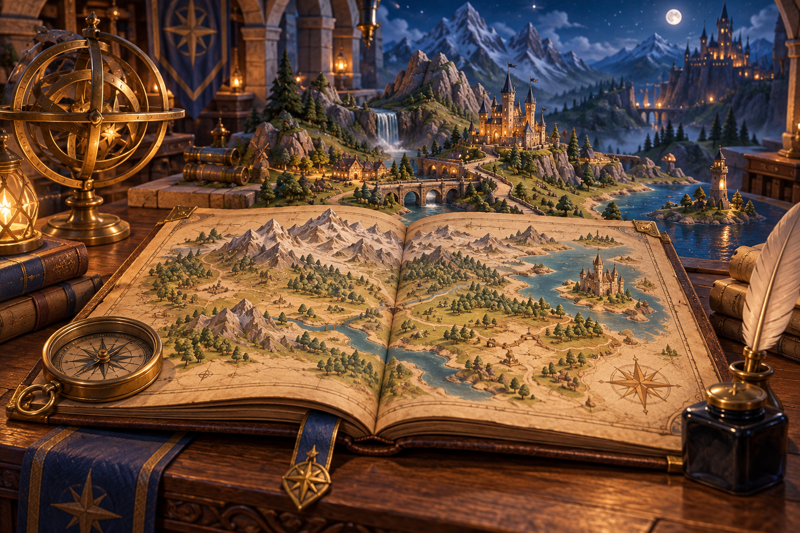
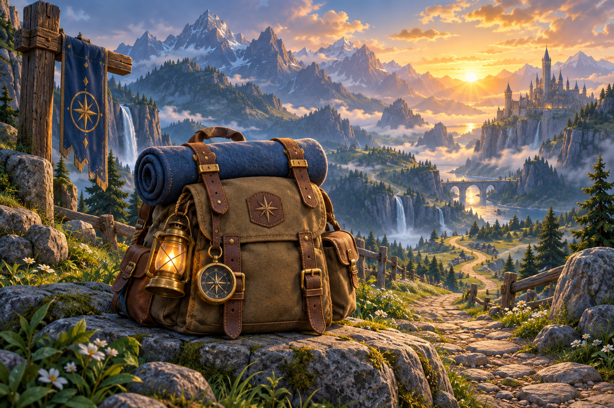

# Превью пяти глав — 2026-09-25

Иллюстрации созданы встроенным `image_gen.imagegen`: по одному отдельному вызову
для каждой главы. Общий ориентир — уютный объёмный сказочный мир существующей
обсерватории, тёмно-синие тени, латунь, камень и тёплый свет фонарей.
Это новые иллюстрации, а не экспорты из Figma. Персонажи, текст и элементы
интерфейса добавляются отдельно в приложении.

Все оригиналы — PNG 1536 × 1024. В Android сохранены lossless exact WebP
того же размера, без обрезки, изменения размера или ретуши. Декодированные
RGBA-пиксели каждого WebP полностью совпадают с исходным PNG. Визуально
проверены все пять изображений.

[Полные промпты всех пяти генераций](generation-specs.json).
JSON рядом с каждым PNG содержит конкретный промпт, исходный путь генерации,
размеры, SHA-256, параметры конвертации и результат проверки.

| Глава | Превью и оригинал PNG | Подробности |
| --- | --- | --- |
| Ночь наблюдений |  | [Промпт и provenance](goal_preview_stargazing.json) |
| Подготовка к башне |  | [Промпт и provenance](goal_preview_tower.json) |
| Дом исследователя |  | [Промпт и provenance](goal_preview_home.json) |
| Карта королевства |  | [Промпт и provenance](goal_preview_kingdom_map.json) |
| Большая экспедиция |  | [Промпт и provenance](goal_preview_expedition.json) |

Превью предназначены для блока с соотношением сторон 3:2. Сюжетные правила,
цены, доступность глав и владение предметами из рисунков не выводятся.
