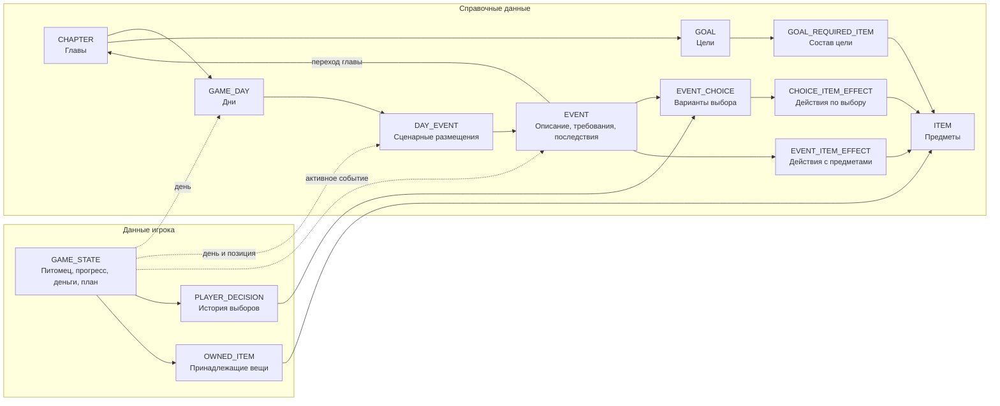

# Текущая модель данных игры

> Текущая версия Room — **v5**. Категория и справочная цена предмета добавлены
> миграцией `4→5` по D-075; владение сохраняется. Миграция `2→3` устраняет конфликт номеров
> схем двух веток с сохранением данных обеих. Поля старой ветки расходов
> сохраняются в `LEGACY_EXPENSE_STATE`, справочники остаются в базе.
> [Точный контракт совместимости](schema-normalization.md#room-v3-совместимость-сохранений-двух-веток--2026-09-19).
> Это техническое исправление загрузки, без новых игровых правил.

> Дополнение реализации, 2026-09-19: исходное описание v1 ниже сохранено.
> В v2 к агрегату добавлен необязательный `GameState.engine`: календарный день,
> фаза дня, шаги, оставшиеся силы, факт питания, ограничение сил следующего утра,
> баланс на начало дня, экземпляры событий и предложения дел. Полный состав
> новых таблиц задан в [нормализованной схеме](schema-normalization.md).
> Старые `satiety`/`fatigue` не переосмысляются и не сбрасываются при миграции.
> Выбранный образ теперь хранится в `selectedLookId: String`; значение прежнего
> `selected_look` сохраняется без перекодирования. Конкретные вещи и события —
> открытый каталог по D-070. [Реализованный механизм и границы](game-engine.md).
>
> Внутренний граф многошагового события пока не вводится: обсуждённый пример
> не подтверждает наличие такого требования в реальном контенте
> (см. уточнение к D-046 в реестре решений).

Обновлено: 2026-09-19. Здесь описан актуальный результат проектирования.
Принятые правила имеют ID в [реестре решений](decisions.md). Техническая
структура реализована в Room v1 по D-043; выбор полей не превращает открытые
вопросы механики в принятые продуктовые решения.

Полные поля всех 13 таблиц, ключи, внешние связи и проверка НФБК находятся в
[нормализованной схеме](schema-normalization.md). Этот документ объясняет их
назначение и содержит открытые вопросы. Правила визуального состояния — в
[спецификации питомца](app-state-machine.md), правила записи — в
[требованиях к сохранению](room-persistence.md).

## 1. Общая карта

10 справочных таблиц описывают контент; 3 таблицы хранят игру. На этой карте
связи логические; физические ключи указаны в нормализованной схеме.

## 2. Справочные данные

**Техническая реализация по D-043:** таблицы и поля представлены Room entities.
Открытые правила механики ниже не исполняются автоматически слоем хранения.

| Таблица | Назначение |
| --- | --- |
| CHAPTER | Глава и ссылка на её цель. |
| GAME_DAY | День и его принадлежность главе. |
| DAY_EVENT | Позиция описания события в авторском расписании дня. |
| EVENT | Содержание, смысловой тип, требования, собственные последствия и возможный переход главы. |
| EVENT_CHOICE | Вариант ответа, его порядок, последствия и фиксированная оценка влияния. |
| ITEM | Описание предмета независимо от владения. |
| GOAL | Название и описание цели. |
| GOAL_REQUIRED_ITEM | Требуемые предметы: по одному экземпляру каждого. |
| EVENT_ITEM_EFFECT | Получение или потеря предмета по событию. |
| CHOICE_ITEM_EFFECT | Получение или потеря предмета по варианту ответа. |

В Room v1 поля `min_satiety` и `max_fatigue` находятся в EVENT.
Предлагаемые проверки: `satiety >= min_satiety`, `fatigue <= max_fatigue`;
`null` означает отсутствие соответствующего ограничения. Само наличие требований
принято в D-023. Поля реализованы как nullable Int; диапазоны, пороги и
включённость границ ещё не утверждены, проверки допуска не исполняются хранилищем.

Денежный `money_delta` меняет общий баланс: положительный добавляет,
отрицательный вычитает, ноль оставляет прежним. Предлагаемый `budget_section`
классифицирует расход и не определяет отдельный источник денег.
`pet_state_* = null` сохраняет визуальное состояние; явный NORMAL снимает его.
`goal_impact` задан для варианта и не вычисляется по типу события или сумме траты.

Предметный эффект содержит ADD или REMOVE. Нет последствий — нет строк;
пустой предмет и операция NONE не требуются (D-018). Позиции сохраняют порядок
и повторяющиеся действия. Момент и правила применения нескольких действий
пока обсуждаются. Целевые события не выдают целевые предметы ни собственным
последствием, ни через вариант ответа (D-038).

### 2.1. Цели: сбор предметов

**Принято пользователем, D-025–D-032, D-038:**

- Одновременно активна одна цель; для неё нужен один экземпляр каждой вещи.
- Достаточно владеть всем комплектом; сдача и расходование вещей не нужны.
- При потере необходимой вещи цель снова невыполнена, если комплекта больше нет.
- Цель меняется вместе с главой. Переход главы требует выполненной текущей цели.
- Целевые предметы можно купить во вкладке цели; целевые события их не выдают.

**Реализованное хранение:** CHAPTER.goal_id определяет цель главы.
GOAL_REQUIRED_ITEM содержит пары `(goal_id, item_id)`; ITEM содержит описания,
OWNED_ITEM — владение. Выполненность вычисляется по этим связям; отдельный
сохраняемый признак завершения или процент не нужен.

Покупка — отдельное действие: общий баланс и владение меняются атомарно.
Искусственное событие для покупки не требуется. Предлагаемая категория расхода —
«Коплю»; это отнесение к плану, а не списание из отдельного кошелька.
По D-075 справочная цена вещи хранится в ITEM.price_coins; у старого контента
она неизвестна (null). Это не история платежей и не механизм покупки.
Условия открытия покупок и повторная покупка после потери пока не определены.

### 2.2. Переход главы

**Принято пользователем, D-031–D-032:** последнее лоровое событие таймлайна
переключает главу при выполненной текущей цели; вместе с главой меняется цель.
Сам сбор последнего предмета не переключает главу.

**Техническое представление:** EVENT.next_chapter_id указывает главу назначения;
пустая ссылка означает отсутствие перехода. При разрешённом переходе обновляется
сюжетная позиция в GAME_STATE, новая цель получается через главу.

Точная стадия перехода, проверка цели до начала или завершения события,
первая позиция новой главы и окончание игры пока открыты.

### 2.3. Типы, появление и прохождение событий

**Принято пользователем:** пять смысловых типов (D-033–D-038).
В Room v1 используется одно поле EVENT.type; коды ниже — техническое
представление категорий, а не дополнительные правила появления событий.

| Тип | Код | Правило |
| --- | --- | --- |
| Состояние | STATE | Голод, усталость, здоровье. Отдельная числовая шкала здоровья не утверждена. |
| Рандомный | RANDOM | Дождь, поломка и другие обстоятельства, требующие разумного денежного решения. |
| ХОЧУ | WANT | Настоящее приятное желание. Тип не определяет отрицательную оценку траты. Сценарное появление — рабочий ориентир. |
| Заработок | EARNING | Игра предлагает при нехватке денег на конкретное действие. Даёт деньги ценой сил и игрового времени. |
| Целевой | STORY | Обязательный шаг сюжета: без предыдущего нельзя перейти к следующему. Целевые предметы здесь не выдаются. |

Тип, причина появления, требования и последствия — разные характеристики.
DAY_EVENT описывает авторское расписание. Выбор из случайного пула, частота,
повторы и способы появления остальных событий ещё не определены.
Нехватка денег для заработка связана со стоимостью конкретного действия,
а не с произвольным общим порогом «маленький баланс».

Низкая сытость как причина предложения еды и достаточная сытость как допуск
к работе — разные проверки. Наблюдение GAME_STATE не должно повторно применять
последствия, пока условие остаётся истинным.

Для расходов сил и времени требуется дополнить последствия. Изменения сытости
и усталости предлагается задавать отдельно от визуального состояния. Единицы
и момент применения этих изменений ещё не согласованы и не включены в полную
ER-схему как готовые поля.

## 3. Состояние игрока

**Принято пользователем, D-024:** питомец, сюжет и экономика хранятся в единой
GAME_STATE. Это не требует объединять все доменные Kotlin-классы.

| Таблица | Реализованное техническое представление |
| --- | --- |
| GAME_STATE | Одно визуальное состояние, образ, сытость, усталость, общий баланс, четыре суммы плана, день, позиция расписания и активное событие. |
| PLAYER_DECISION | ID факта, ссылка на сохранение, позиция истории и choice_id. Событие и оценка получаются через EVENT_CHOICE. |
| OWNED_ITEM | ID строки владения, ссылка на сохранение, позиция и item_id. Описание предмета получается через ITEM. |

Предложенный курсор `(current_day_id, next_script_position)` указывает на
DAY_EVENT. День определяет главу, глава — цель; эти значения не дублируются.
`active_event_id` описывает фактически открытое событие, включая заработок вне
расписания. Это не тот же факт, что следующая позиция сценария.

Повторяющиеся решения и вещи сохраняются отдельными строками; их игровая
допустимость не определяется ограничениями уникальности ради удобства БД.
Стадии событий, контекст возврата и критерий завершения ещё нужно описать.

История решений получает оценку по ссылке на справочник. Для такого варианта
нужен неизменный смысл уже использованных идентификаторов либо модель версий.
Текущая реализация запрещает изменение определений под существующими ID.
Редактор контента и автоматическое обновление пакетов пока не реализованы.

### 3.1. Бюджет

**Принято пользователем, D-039–D-040:** деньги общие, секции описывают план:
«Нужно», «Хочу», «Коплю», «На всякий случай».

**Техническое представление:** GAME_STATE хранит общий `balance` и четыре суммы
`planned_needs`, `planned_wants`, `planned_savings`, `planned_reserve`.
Их размещение в одной записи соответствует проверенным зависимостям НФБК.
Плановые суммы не являются дополнительными фактическими деньгами.

Предлагается не уменьшать план при покупках: расход меняет баланс, категория
относит его к секции плана. Единицы, период, возможность редактирования и
ограничения перерасхода ещё не утверждены. История фактических трат по секциям
требует отдельного решения; из одного общего баланса её не получить.

**Принято пользователем, D-021:** доход — 100 монет за игровую неделю.
Таблица настройки дохода не нужна. Время начисления и связь суммы плана с
недельным доходом пока открыты; равенство плана 100 монетам не вводится.

## 4. Использование и сохранение

Справочники дают содержание события, требования и последствия. Игровая логика
проверяет текущие данные, применяет последствия и сохраняет относящиеся к одному
исходу изменения атомарно. Справочные строки при прохождении не переписываются.
Правила ошибок, инициализации и миграций — в требованиях к сохранению.

Меню наблюдает сохранённое состояние через Room (D-043). Заготовка из
первоначального этапа D-007 создаётся только при отсутствии сохранения.
Реализованы таблицы, целостность и атомарные записи; прохождение событий,
покупки и начисления пока не подключены.

## 5. Открытые вопросы

- Диапазоны сытости и усталости, границы требований и связь с визуальным состоянием.
- Выбор и повторы событий, нумерация дней, ветвления и критерий завершения события.
- Стадии, прерывание/возврат и защита от повторного применения последствий.
- Единицы и затраты игрового времени, сил и изменения параметров питомца.
- Стадия финального перехода главы, окончание игры и состояния без активной цели.
- Цены предметов, открытие и повторение покупок; получение целевых вещей из других типов событий.
- Дубликаты предметов, потеря отсутствующей или надетой вещи и связь с образом.
- Единицы и период плана, редактирование, перерасход и учёт фактических трат.
- Момент недельного дохода, поведение плана при смене главы и влияние потери предмета на пройденные главы.
- Развитие технического курсора и редактора контента. Текущий импорт сохраняет
  определения неизменными по ID; изменения требуют новых идентичностей.

Приблизительные 7 дней, 4–5 целей и 4–5 событий в день остаются рабочими
ориентирами из реестра, а не строгими ограничениями схемы.

## Дополнение к обсуждению игрового цикла — 2026-09-19

Дополнения записаны по пояснениям пользователя от 2026-09-19. Исходные
формулировки других авторов выше сохранены без изменений. Эти записи не
разрешают молча заменять исходные данные; расхождения требуют согласования.

В частности, исходный ориентир «примерно 7 игровых дней, 4–5 целей за игру,
4–5 событий в дне, из которых одно лоровое» сохраняется. Новое описание
3–5 событий и обычно не более 1–2 лоровых нужно сопоставить с этим ориентиром;
общую длительность игры и количество целей пользователь не пересматривал.

**Пояснения пользователя · D-045–D-056 · 2026-09-19:**

- Фабрика создаёт события. Связанная многошаговая ситуация является одним
  событием; конкретные программные интерфейсы ещё не выбраны.
- Цикл разбит на недели: ребёнок получает 100 монет и распределяет их по
  четырём частям плана. Перенос остатка и точная стадия начисления открыты.
- В дне 3–5 последовательных событий, обычно не более 1–2 лоровых. Остальные
  могут быть случайными, обязательными и необязательными; конкуренции событий нет.
- Минимум раз в день нужно поесть. Роскошный обед даёт только преимущество
  в настроении; дополнительная полезность относительно минимального не вводится.
- Силы расходуются частями: лёгкая нагрузка 1, средняя 2, сильная 3.
  Обычно после пробуждения запас полный; 4 или 5 частей — пока открытый выбор.
  Это смысл расходуемого ресурса, а не утверждённое переименование поля Room
  `fatigue` или формула преобразования уже сохранённых значений.
- Если сил для действия не хватает, предлагается сон. Если в этот день ещё
  не ели, сначала нужна еда. При полном отсутствии денег нужен доступный выход.
- Голод нарастает с продвижением через события. При блокирующем голоде кнопка
  действия в событии меняется на еду; после еды можно продолжить дело.
- Время продвигают «Продолжить день», перемещение по карте и покупка части цели.
  Единица времени и расход сил пока не связаны общей формулой.
- В конце дня показывают изменение бюджета и прогресс лора за день.
- Части цели покупаются независимо от событий, в любой момент. Если покупка
  оставляет недостаточно средств на нужды, требуется предупреждение о еде.
- Финальное событие главы скрыто до покупки полного комплекта. Другие события
  тоже могут требовать определённые купленные части; D-031 сохраняет проверку
  владения комплектом при переходе главы.

**Пример — не принято:** бесплатная столовая и ограничение следующего утра
до 3 из 5 сил. Конкретный выход, последствия и их длительность ещё обсуждаются.
Отдельная кнопка кормления на главном экране также пока предложение.

Открыты единица хода, окончание дня, перенос незавершённого события после сна,
порог голода и его поведение после еды, последствия промежуточных шагов,
возврат после заработка и работа расписания при закрытом предметом событии.
Эти правила определят изменения схемы; Room v1 пока не хранит полноценный
многошаговый процесс, недельное планирование и данные для дневного отчёта.

## Дополнение: шаг дня и сроки дел — 2026-09-19

Это последующие пояснения пользователя, записанные в D-057–D-065
[реестра решений](decisions.md). Исходные формулировки выше сохраняются.
D-057 уточняет предыдущие 3–5 событий до 4–5, а шаг связывает с выполнением
события или дела. Общая длительность игры и количество целей не меняются.

Шаг дня и расход сил различаются: завершённое событие занимает шаг,
а силы расходуют дела, неожиданно неприятные события и путешествия. Путешествие
может требовать деньги либо силы. Если силы закончились раньше лорового события,
его выполнение переносится на следующий день. После окончания событий дня
кнопка «Продолжить день» меняется на «Закончить день», даже если силы остались.

Предложенное дело доступно позже через меню «Дела». Принятый срок D-062:

| Стоимость дела в силах | Доступность предложения |
| --- | --- |
| 1 часть | До конца сегодняшнего дня |
| 2 части | До конца сегодня и завтра |
| 3 части | До конца сегодня, завтра и послезавтра |

После истечения срока предложение исчезает; такое дело может встретиться вновь
в будущем. Возможность повторения не означает немедленное автоматическое
создание нового предложения. Учёт дня должен быть игровым, без реального таймера.

Обычно одного приёма пищи достаточно на день. Обычная еда повышает сытость,
не восстанавливает силы; роскошная дополнительно даёт хорошее настроение.
Бесплатная еда вызывает упадок сил на следующий день; точная величина ещё открыта.
В начале недели объясняются обязательные расходы на питание и известные поездки.
Цена еды 4 или 5 монет пока пример. Бюджет допускает изменения и использование
накоплений для нужд; фактические деньги не резервируются. При голоде и отказе
игрока кормить герой сам берёт на еду из накоплений. Момент этого действия
и отражение в плане пока не заданы, отдельные реальные кошельки не вводятся.

**Предложение устройства — не принято:** отдельно описывать содержание дела,
конкретное предложение со сроком и факт выполнения. Это позволит отличать
отложенное предложение от будущего повторного появления той же работы.
Таблицы и поля Room для такого жизненного цикла пока не спроектированы.

**Уточнение к предыдущему блоку о многошаговости:** пользователь поставил её
необходимость под вопрос. Мост был примером агента, а не найденным событием
контента. Не считать внутренние сценарные графы и промежуточные платежи
утверждённым требованием; отдельные экраны выбора и результата могут составлять
одно обычное событие.

Открыты учёт предложения/отказа в шагах, выполнение дел после лимита дня,
позиция перенесённого лора, стоимость шага покупки и перемещения, момент
автоматического питания и учёт изменения частей бюджета. Значения сил 4/5,
стоимости еды и ограничения после бесплатного питания ещё требуют выбора.

## Дополнение: день остаётся открыт для короткого дела — 2026-09-19

D-066–D-067 в [реестре решений](decisions.md) уточняют границы предыдущего
описания. Предложение дела занимает шаг, даже если выполнение отложено;
позднейшее выполнение — отдельный шаг. После основных 4–5 событий можно
выполнить оставшееся короткое дело до нажатия «Закончить день».

Поэтому окончание основной последовательности событий и завершение самого
дня различаются. Дело со сроком «до конца сегодня» не исчезает только из-за
достижения 4–5 событий. Требования к силам и питанию продолжают действовать.
Разрешение на короткое дело не означает согласованную возможность запускать
любые новые события или длинные работы после основного расписания.

D-068 записывает предложенное пользователем уточнение к D-064: питомец просит
покормить его и объясняет необходимость потратить накопления. Автоматическую
покупку не следует выводить из такого предложения. Окончательная реакция на
отказ и текст реплики ещё требуют уточнения; исходные записи не переписаны.

## Room v4: история разделения показателя и успешные мини-игры — 2026-09-19

Разделение голода исправлено в v6 по D-076; ниже описан сохранённый путь миграции v4.

Правила затрат приняты в [D-072](decisions.md). Миграция `3→4` добавляет
`GAME_STATE.hunger INTEGER NOT NULL DEFAULT 0`, сохраняя все прежние поля,
включая `satiety` и `fatigue`, без пересчёта. Начальное значение нового голода — 0.

`MINI_GAME_COMPLETION(attempt_id TEXT PRIMARY KEY, game_state_id TEXT NOT NULL)`
содержит FK на `GAME_STATE.id` и индекс `game_state_id`. Это подтверждения
уже учтённых попыток: `attempt_id → game_state_id`, единственный детерминант —
ключ, поэтому таблица соответствует НФБК. В `GAME_STATE` новое поле зависит
только от ключа сохранения. Производные затраты и значения шкал в подтверждении
не дублируются. Подтверждения представлены `GameState.completedMiniGames`.

Результат меняет голод, усталость и набор подтверждений одной транзакцией
агрегатного репозитория. Проверка лимитов читает актуальный агрегат; повторный
ID возвращает уже сохранённый результат без начисления. Ошибка записи показывается
пользователю с повтором. Миграция и повтор после открытия БД покрыты тестом
`GameSchemaTest.versionThreeAddsHungerWithoutReinterpretingExistingValues`;
по текущей настройке проверки тест добавлен, но на устройстве не запускается.

## Инвентарь — 2026-09-19

По [D-075](decisions.md) экран показывает только OWNED_ITEM в двух разделах,
без группировки по главам. В `ItemDefinition` и `ITEM` добавлены категория
отображения STORY/ACCESSORY и nullable справочная цена `priceCoins`/`price_coins`.
Категория не запрещает аксессуару участвовать в событиях или цели. Владение,
косметический образ и справочник по-прежнему независимы. Подробности миграции
и НФБК — в [схеме v5](schema-normalization.md#room-v5-категория-и-цена-предмета--2026-09-19).

## Room v6: единый показатель голода — 2026-09-19

По [D-076](decisions.md) `GAME_STATE.satiety` — единственное поле голода;
отдельного `hunger` в текущей схеме и доменном агрегате нет. В меню `hunger`
может использоваться как имя UI-проекции `satiety`, без отдельного хранения.
Новая игра начинается с 0. Мини-игры увеличивают `satiety` на 20 и проверяют
`satiety + 20 <= 100` вместе с затратами усталости по D-072.

Миграция `5→6` выполняет `satiety = satiety + hunger`, затем удаляет только
столбец `hunger`. В v4/v5 он содержал отдельные накопленные прибавки мини-игр,
а исходный `satiety` ими не менялся. Сложение сохраняет оба вклада, без обрезки
или обнуления. Остальные поля, дочерние строки, их порядок и подтверждения
завершения сохранены; повтор результата не начисляет затраты заново.
`id → satiety` сохраняет НФБК без дублирующего столбца.

`HungerMigrationTest` покрывает ненулевые оба поля, сохранение владения и
подтверждений, повтор записи, переоткрытие и сумму выше лимита. По настройке
пользователя тесты только компилируются, запуск на устройстве не выполняется.
