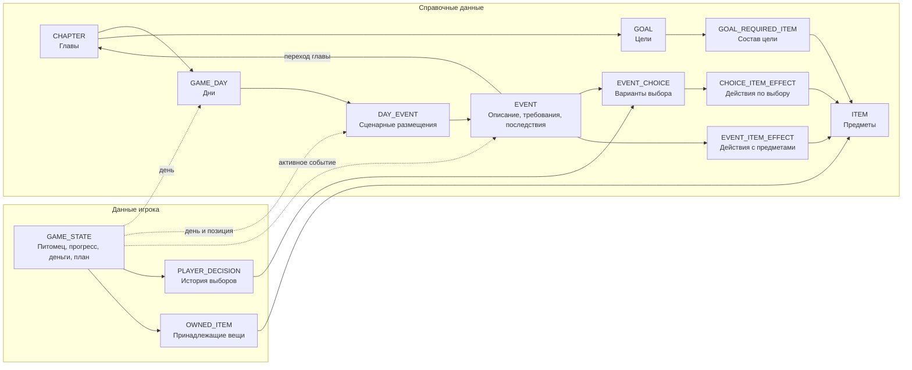

# Текущая модель данных игры

Обновлено: 2026-09-19. Здесь описан актуальный результат проектирования.
Принятые правила имеют ID в [реестре решений](decisions.md). Техническая
структура реализована в Room v1 по D-043; выбор полей не превращает открытые
вопросы механики в принятые продуктовые решения.

Полные поля всех 13 таблиц, ключи, внешние связи и проверка НФБК находятся в
[нормализованной схеме](schema-normalization.md). Этот документ объясняет их
назначение и содержит открытые вопросы. Правила визуального состояния — в
[спецификации питомца](app-state-machine.md), правила записи — в
[требованиях к сохранению](room-persistence.md).

## 1. Общая карта

10 справочных таблиц описывают контент; 3 таблицы хранят игру. На этой карте
связи логические; физические ключи указаны в нормализованной схеме.

## 2. Справочные данные

**Техническая реализация по D-043:** таблицы и поля представлены Room entities.
Открытые правила механики ниже не исполняются автоматически слоем хранения.

| Таблица | Назначение |
| --- | --- |
| CHAPTER | Глава и ссылка на её цель. |
| GAME_DAY | День и его принадлежность главе. |
| DAY_EVENT | Позиция описания события в авторском расписании дня. |
| EVENT | Содержание, смысловой тип, требования, собственные последствия и возможный переход главы. |
| EVENT_CHOICE | Вариант ответа, его порядок, последствия и фиксированная оценка влияния. |
| ITEM | Описание предмета независимо от владения. |
| GOAL | Название и описание цели. |
| GOAL_REQUIRED_ITEM | Требуемые предметы: по одному экземпляру каждого. |
| EVENT_ITEM_EFFECT | Получение или потеря предмета по событию. |
| CHOICE_ITEM_EFFECT | Получение или потеря предмета по варианту ответа. |

В Room v1 поля `min_satiety` и `max_fatigue` находятся в EVENT.
Предлагаемые проверки: `satiety >= min_satiety`, `fatigue <= max_fatigue`;
`null` означает отсутствие соответствующего ограничения. Само наличие требований
принято в D-023. Поля реализованы как nullable Int; диапазоны, пороги и
включённость границ ещё не утверждены, проверки допуска не исполняются хранилищем.

Денежный `money_delta` меняет общий баланс: положительный добавляет,
отрицательный вычитает, ноль оставляет прежним. Предлагаемый `budget_section`
классифицирует расход и не определяет отдельный источник денег.
`pet_state_* = null` сохраняет визуальное состояние; явный NORMAL снимает его.
`goal_impact` задан для варианта и не вычисляется по типу события или сумме траты.

Предметный эффект содержит ADD или REMOVE. Нет последствий — нет строк;
пустой предмет и операция NONE не требуются (D-018). Позиции сохраняют порядок
и повторяющиеся действия. Момент и правила применения нескольких действий
пока обсуждаются. Целевые события не выдают целевые предметы ни собственным
последствием, ни через вариант ответа (D-038).

### 2.1. Цели: сбор предметов

**Принято пользователем, D-025–D-032, D-038:**

- Одновременно активна одна цель; для неё нужен один экземпляр каждой вещи.
- Достаточно владеть всем комплектом; сдача и расходование вещей не нужны.
- При потере необходимой вещи цель снова невыполнена, если комплекта больше нет.
- Цель меняется вместе с главой. Переход главы требует выполненной текущей цели.
- Целевые предметы можно купить во вкладке цели; целевые события их не выдают.

**Реализованное хранение:** CHAPTER.goal_id определяет цель главы.
GOAL_REQUIRED_ITEM содержит пары `(goal_id, item_id)`; ITEM содержит описания,
OWNED_ITEM — владение. Выполненность вычисляется по этим связям; отдельный
сохраняемый признак завершения или процент не нужен.

Покупка — отдельное действие: общий баланс и владение меняются атомарно.
Искусственное событие для покупки не требуется. Предлагаемая категория расхода —
«Коплю»; это отнесение к плану, а не списание из отдельного кошелька.
Цена ещё требует решения о зависимости от предмета или пары «цель — предмет».
Условия открытия покупок и повторная покупка после потери пока не определены.

### 2.2. Переход главы

**Принято пользователем, D-031–D-032:** последнее лоровое событие таймлайна
переключает главу при выполненной текущей цели; вместе с главой меняется цель.
Сам сбор последнего предмета не переключает главу.

**Техническое представление:** EVENT.next_chapter_id указывает главу назначения;
пустая ссылка означает отсутствие перехода. При разрешённом переходе обновляется
сюжетная позиция в GAME_STATE, новая цель получается через главу.

Точная стадия перехода, проверка цели до начала или завершения события,
первая позиция новой главы и окончание игры пока открыты.

### 2.3. Типы, появление и прохождение событий

**Принято пользователем:** пять смысловых типов (D-033–D-038).
В Room v1 используется одно поле EVENT.type; коды ниже — техническое
представление категорий, а не дополнительные правила появления событий.

| Тип | Код | Правило |
| --- | --- | --- |
| Состояние | STATE | Голод, усталость, здоровье. Отдельная числовая шкала здоровья не утверждена. |
| Рандомный | RANDOM | Дождь, поломка и другие обстоятельства, требующие разумного денежного решения. |
| ХОЧУ | WANT | Настоящее приятное желание. Тип не определяет отрицательную оценку траты. Сценарное появление — рабочий ориентир. |
| Заработок | EARNING | Игра предлагает при нехватке денег на конкретное действие. Даёт деньги ценой сил и игрового времени. |
| Целевой | STORY | Обязательный шаг сюжета: без предыдущего нельзя перейти к следующему. Целевые предметы здесь не выдаются. |

Тип, причина появления, требования и последствия — разные характеристики.
DAY_EVENT описывает авторское расписание. Выбор из случайного пула, частота,
повторы и способы появления остальных событий ещё не определены.
Нехватка денег для заработка связана со стоимостью конкретного действия,
а не с произвольным общим порогом «маленький баланс».

Низкая сытость как причина предложения еды и достаточная сытость как допуск
к работе — разные проверки. Наблюдение GAME_STATE не должно повторно применять
последствия, пока условие остаётся истинным.

Для расходов сил и времени требуется дополнить последствия. Изменения сытости
и усталости предлагается задавать отдельно от визуального состояния. Единицы
и момент применения этих изменений ещё не согласованы и не включены в полную
ER-схему как готовые поля.

## 3. Состояние игрока

**Принято пользователем, D-024:** питомец, сюжет и экономика хранятся в единой
GAME_STATE. Это не требует объединять все доменные Kotlin-классы.

| Таблица | Реализованное техническое представление |
| --- | --- |
| GAME_STATE | Одно визуальное состояние, образ, сытость, усталость, общий баланс, четыре суммы плана, день, позиция расписания и активное событие. |
| PLAYER_DECISION | ID факта, ссылка на сохранение, позиция истории и choice_id. Событие и оценка получаются через EVENT_CHOICE. |
| OWNED_ITEM | ID строки владения, ссылка на сохранение, позиция и item_id. Описание предмета получается через ITEM. |

Предложенный курсор `(current_day_id, next_script_position)` указывает на
DAY_EVENT. День определяет главу, глава — цель; эти значения не дублируются.
`active_event_id` описывает фактически открытое событие, включая заработок вне
расписания. Это не тот же факт, что следующая позиция сценария.

Повторяющиеся решения и вещи сохраняются отдельными строками; их игровая
допустимость не определяется ограничениями уникальности ради удобства БД.
Стадии событий, контекст возврата и критерий завершения ещё нужно описать.

История решений получает оценку по ссылке на справочник. Для такого варианта
нужен неизменный смысл уже использованных идентификаторов либо модель версий.
Текущая реализация запрещает изменение определений под существующими ID.
Редактор контента и автоматическое обновление пакетов пока не реализованы.

### 3.1. Бюджет

**Принято пользователем, D-039–D-040:** деньги общие, секции описывают план:
«Нужно», «Хочу», «Коплю», «На всякий случай».

**Техническое представление:** GAME_STATE хранит общий `balance` и четыре суммы
`planned_needs`, `planned_wants`, `planned_savings`, `planned_reserve`.
Их размещение в одной записи соответствует проверенным зависимостям НФБК.
Плановые суммы не являются дополнительными фактическими деньгами.

Предлагается не уменьшать план при покупках: расход меняет баланс, категория
относит его к секции плана. Единицы, период, возможность редактирования и
ограничения перерасхода ещё не утверждены. История фактических трат по секциям
требует отдельного решения; из одного общего баланса её не получить.

**Принято пользователем, D-021:** доход — 100 монет за игровую неделю.
Таблица настройки дохода не нужна. Время начисления и связь суммы плана с
недельным доходом пока открыты; равенство плана 100 монетам не вводится.

## 4. Использование и сохранение

Справочники дают содержание события, требования и последствия. Игровая логика
проверяет текущие данные, применяет последствия и сохраняет относящиеся к одному
исходу изменения атомарно. Справочные строки при прохождении не переписываются.
Правила ошибок, инициализации и миграций — в требованиях к сохранению.

Меню наблюдает сохранённое состояние через Room (D-043). Заготовка из
первоначального этапа D-007 создаётся только при отсутствии сохранения.
Реализованы таблицы, целостность и атомарные записи; прохождение событий,
покупки и начисления пока не подключены.

## 5. Открытые вопросы

- Диапазоны сытости и усталости, границы требований и связь с визуальным состоянием.
- Выбор и повторы событий, нумерация дней, ветвления и критерий завершения события.
- Стадии, прерывание/возврат и защита от повторного применения последствий.
- Единицы и затраты игрового времени, сил и изменения параметров питомца.
- Стадия финального перехода главы, окончание игры и состояния без активной цели.
- Цены предметов, открытие и повторение покупок; получение целевых вещей из других типов событий.
- Дубликаты предметов, потеря отсутствующей или надетой вещи и связь с образом.
- Единицы и период плана, редактирование, перерасход и учёт фактических трат.
- Момент недельного дохода, поведение плана при смене главы и влияние потери предмета на пройденные главы.
- Развитие технического курсора и редактора контента. Текущий импорт сохраняет
  определения неизменными по ID; изменения требуют новых идентичностей.

Приблизительные 7 дней, 4–5 целей и 4–5 событий в день остаются рабочими
ориентирами из реестра, а не строгими ограничениями схемы.
