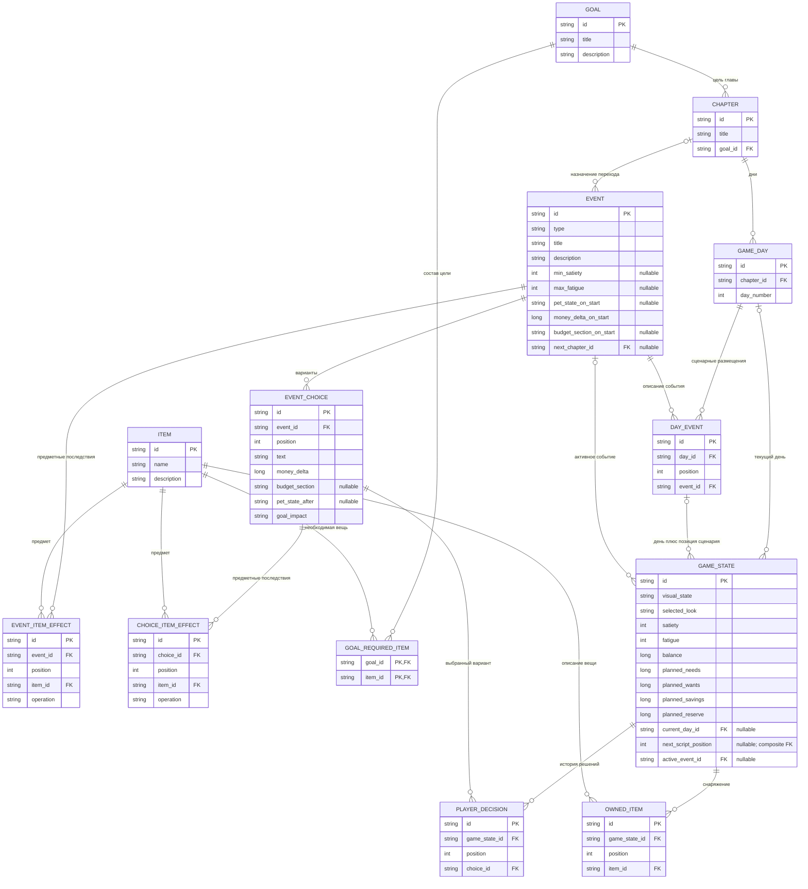

# Нормализация схемы данных: 3НФ и НФБК

## Room v3: совместимость сохранений двух веток — 2026-09-19

Техническое исправление ошибки загрузки: две ветки использовали версию 2
для разных схем. Экспортированная v2 движка и установленная v2 расходов
(`identity_hash = 60def24db827a0073f78e5218e023b32`) сходятся в v3.
Схемы v1 и v2 остаются неизменёнными; актуальный экспорт —
[3.json](../../app/schemas/ru.nksk.lctapp.data.game.local.GameDatabase/3.json).

Добавлена `LEGACY_EXPENSE_STATE`: `game_state_id TEXT` — PK и FK →
`GAME_STATE.id`; `expense_sequence INTEGER`, `expense_stage TEXT`,
`earning_attempt INTEGER` — NOT NULL. Единственный определитель — ключ
сохранения; зависимых копий и нарушения НФБК нет. Таблица хранит совместимость
со старой веткой, не вводит правила игрового движка. В новой игре она пуста.

Миграция `2→3` переносит три дополнительных поля старой `GAME_STATE` в эту
таблицу перед удалением исходных столбцов. Остальные поля и связанные строки
остаются на месте. Справочники `ARTWORK`, `EFFORT_LEVEL`, `EXPENSE`,
`EXPENSE_CHOICE_RULE`, `EVENT_ARTWORK_LAYER` из старой ветки сохраняются
без изменений как дополнительные таблицы; текущая ветка их не использует.
Отсутствующие таблицы движка создаются; существующие данные движка не меняются.
Переход из v1 проходит по цепочке `1→2→3`. Ошибка миграции откатывает транзакцию;
удаления базы или замены сохранения начальными данными нет.


## Дополнение Room v2 — 2026-09-19

Исходная схема v1 ниже сохранена. V2 добавляет три таблицы (всего 16),
не изменяя прежние поля, ключи и значения. Это техническая модель выполнения
движка по D-069; численные настройки механики остаются явной конфигурацией.

| Таблица | Поля | Ключи и ссылки |
| --- | --- | --- |
| `ENGINE_STATE` | `game_state_id`, `rules_id`, `revision`, `day`, `phase`, `steps`, `energy`, `ate_today`, `next_morning_energy?`, `opening_balance` | PK `game_state_id`, одновременно FK → `GAME_STATE.id` |
| `ENGINE_DEED` | `id`, `game_state_id`, `position`, `event_id`, `expires_day`, `completed` | PK `id`; альтернативный ключ `(game_state_id, position)`; FK игры → `ENGINE_STATE.game_state_id`; FK события → `EVENT.id` |
| `ENGINE_EVENT` | `id`, `game_state_id`, `position`, `event_id?`, `status`, `deed_offer_id?` | PK `id`; альтернативный ключ `(game_state_id, position)`; FK игры → `ENGINE_STATE.game_state_id`; FK события → `EVENT.id`; nullable UNIQUE FK предложения → `ENGINE_DEED.id` |

Зависимости в `ENGINE_STATE`: ключ игры определяет все скалярные факты
текущего выполнения. `opening_balance` — исторический баланс на начало дня,
а не копия текущего баланса. `revision` защищает команды от устаревшего состояния.
Параметры питания и сил v1 не дублируются: их прежняя семантика не определена
достаточно, чтобы безопасно интерпретировать старые значения в новой шкале.

В `ENGINE_DEED` каждый из двух ключей определяет остальные поля. Срок хранится
как включительный номер последнего доступного календарного дня; начало и
длительность рядом не дублируются. Одинаковое определение дела может иметь
несколько разных предложений со своими ID и сроками. Запрет повторного
выполнения относится к одному предложению, а не ко всем будущим предложениям.

В `ENGINE_EVENT` ровно одна ссылка задана: либо `event_id` для основного плана,
либо `deed_offer_id` для выполнения дела. Для второго варианта определение
события получается через предложение. Тип происхождения не хранится отдельным
столбцом. Непустой `deed_offer_id` уникален: у предложения одно выполнение.
Это альтернативный ключ для подмножества выполнений дел; в нём зависимость
предложения от игры не создаёт неключевого определителя. В подмножестве
основного плана определители — `id` и `(game_state_id, position)`. Таким образом,
обе логические разновидности соответствуют НФБК; таблица хранит их объединение
с nullable ссылками. Исключительность ссылок проверяет mapping и доменная
модель, ссылочную целостность и уникальность — SQLite.

В доменном снимке `eventId` и `origin` материализуются для удобства движка;
это не дублирование полей в Room. Позиции сохраняют порядок, а повторы одного
`event_id` допустимы. Никаких ограничений числа недель, глав или строк каталога
не добавляется. План основного дня проверяет движок, не схема БД.

Миграция [GameMigrations.kt](../../app/src/main/java/ru/nksk/lctapp/data/game/local/GameMigrations.kt)
создаёт только новые таблицы и индексы. Экспорт
[2.json](../../app/schemas/ru.nksk.lctapp.data.game.local.GameDatabase/2.json)
проверяется относительно неизменённого
[1.json](../../app/schemas/ru.nksk.lctapp.data.game.local.GameDatabase/1.json).
Ограничения текущего механизма описаны в [game-engine.md](game-engine.md).

## Исходное описание v1

Дата: 2026-09-19. Основание — D-041 в [реестре решений](decisions.md) и
требование НФБК в [AGENTS.md](../../AGENTS.md). Документ уточняет
[общую схему](game-data-schema.md). Room v1 реализован по D-043. Здесь 13 таблиц:
10 справочных и 3 таблицы состояния игрока. Это единственный документ с полным
набором полей и ключей v1; [требования к сохранению](room-persistence.md)
описывают правила записи и восстановления.

**Статус:** нормализованная структура реализована в Room v1 по D-043.
Принятые продуктовые требования отмечены в реестре; конкретные ключи и курсор
ниже — выбранное техническое представление, не новые игровые правила.
Все 13 отношений удовлетворяют НФБК при описанных ниже зависимостях. Это также
обеспечивает 3НФ, но не доказывает полноту пока не согласованной игровой механики.
Изменение функциональных зависимостей требует повторной проверки.

## 1. Критерий и область проверки

`X → Y` означает, что одинаковые значения X всегда определяют одинаковые Y
в допустимых данных. Для НФБК определяющая часть каждой нетривиальной зависимости
должна быть суперключом. Само добавление столбца `id` не устраняет зависимость
между другими столбцами. Определения НФБК и 3НФ:
[Database System Concepts, глава 7](https://www.db-book.com/slides-dir/PDF-dir/ch7.pdf),
слайды 7.23 и 7.28.

Проверяем отношения и их смысловые зависимости, а не совпадения значений
в одном примере. Например, одинаковый доход не требует справочника доходов,
а единственный экземпляр локального сохранения не делает каждую его колонку
смысловым ключом. Все поля ниже скалярные; списки предметов, эффектов и решений
представлены строками дочерних таблиц.

Границы проверки:

- `GAME_STATE` хранит одно текущее состояние игры (D-024); ID нужен для ссылок,
  а не для введения профилей или нескольких слотов сохранения.
- Для сценарных размещений используется уже обсуждавшийся фиксированный
  `DAY_EVENT`. Выбор случайных событий и ветвление этой схемой не утверждаются.
- Четыре суммы плана — самостоятельные значения (D-039–D-040). Правило,
  вычисляющее одну сумму через другие, доход или баланс, не принято.
- Коды типа события, состояния, образа, бюджетной секции и оценки выбора
  рассматриваются как атомарные значения. Их подписи и оформление не копируются
  в каждую строку. Отдельный справочник только ради фиксированного кода не нужен.
- Опциональные ссылки показаны как nullable SQL-поля. Анализ зависимостей
  относится к их определённым значениям; отсутствие ссылки не является
  фиктивным событием, предметом или главой.

## 2. Полная схема

`PK` — первичный ключ, `FK` — внешний ключ. Составные альтернативные ключи
перечислены в разделе 3: Mermaid не показывает составной `UNIQUE` отдельной
группой. Типы диаграммы описательные; Room-аннотации находятся в `data/game/local`.
Экспорт первой версии — [1.json](../../app/schemas/ru.nksk.lctapp.data.game.local.GameDatabase/1.json).



Составной FK из `GAME_STATE(current_day_id, next_script_position)` ведёт
на `DAY_EVENT(day_id, position)`. `current_day_id` также самостоятельно
ссылается на `GAME_DAY.id`. Ссылку на день можно сохранить, когда следующего
сценарного размещения в нём уже нет; тогда `next_script_position = null`.
Обратный случай — заданная позиция без дня — отклоняется моделью StoryState.
Для nullable ссылок диаграмма не предписывает поведение начала и конца игры.

## 3. Ключи и функциональные зависимости всех таблиц

Для каждой строки таблицы ниже указанные ключи определяют все её остальные
столбцы. Другие нетривиальные зависимости внутри отношения текущими правилами
не установлены. Именно при этом наборе зависимостей вывод о НФБК верен.

| Таблица | Первичный ключ | Дополнительный кандидат в ключ | Определяемые данные и проверка |
| --- | --- | --- | --- |
| `CHAPTER` | `id` | Не задан | Название и `goal_id`. Название цели находится в `GOAL`; один `goal_id` не объявляется уникальным для всех глав. |
| `GAME_DAY` | `id` | Не задан | Глава и номер дня. Название главы и её цель не копируются сюда. Уникальность номера дня пока не вводится: область нумерации не согласована. |
| `DAY_EVENT` | `id` | `(day_id, position)` | Размещение определяет событие. Главы и описания события здесь нет. Один `event_id` может встречаться в разных размещениях. |
| `EVENT` | `id` | Не задан | Тип, текст, требования, собственные последствия и переход. Тип не определяет цену, бюджетную секцию или реакцию; дополнительных зависимостей между этими значениями не задано. |
| `EVENT_CHOICE` | `id` | `(event_id, position)` | Вариант определяет родительское событие, текст, последствия и `goal_impact`. Название/тип события не копируются в вариант. |
| `ITEM` | `id` | Не задан | Название и описание вещи. Название не объявляется уникальным. Размещение цены зависит от отдельного решения; см. раздел 6. |
| `GOAL` | `id` | Не задан | Название и описание. Нет текущего процента выполнения, стоимости комплекта или строки с перечнем вещей. |
| `GOAL_REQUIRED_ITEM` | `(goal_id, item_id)` | Не задан | Только связь. Неключевых атрибутов нет; частичных и транзитивных зависимостей нет. Требуется один экземпляр, поэтому поле количества не добавляется. |
| `EVENT_ITEM_EFFECT` | `id` | `(event_id, position)` | Одно действие над предметом. Название вещи не копируется; одинаковые действия в разных позициях сохраняются. |
| `CHOICE_ITEM_EFFECT` | `id` | `(choice_id, position)` | Одно действие конкретного варианта. Нет дублирующего `event_id`, который определялся бы через `choice_id`. |
| `GAME_STATE` | `id` | Не задан | Текущие параметры, общий баланс, четыре плановых суммы и независимые компоненты прогресса. Нет названий справочников, отдельной текущей цели и дублирующей главы. |
| `PLAYER_DECISION` | `id` | `(game_state_id, position)` | Факт выбора в истории. Событие и фиксированная оценка получаются через `choice_id`; повтор того же выбора разрешён структурой. |
| `OWNED_ITEM` | `id` | `(game_state_id, position)` | Строка владения одной вещью. Описание находится в `ITEM`; `(game_state_id, item_id)` не объявляется ключом. |

Дополнительные ключи по позиции — предлагаемое техническое представление
упорядоченного списка: у каждой строки одна позиция внутри её родителя.
Одинаковые значения `event_id`, `choice_id`, `item_id` в разных позициях
не запрещены. Пропуски в нумерации допустимы; позиции не вычисляются из ID.
Это не решение о допустимости повторов в игровом сценарии, а способ не потерять
их, если они появятся. Для `GOAL_REQUIRED_ITEM` уникальность пары описывает
одно требование иметь предмет по D-027 и не ограничивает инвентарь.

При заданных ключах нет зависимости неключевого столбца от части составного
ключа или от другого неключевого столбца. Введение будущего правила, например
единой цены для всех предметов определённого вида, добавило бы зависимость;
тогда цену следовало бы вынести к этому виду, а не считать `id` решением проблемы.

## 4. Что хранится и что получается по связям

### Решения игрока

Сохраняем `PLAYER_DECISION.choice_id`. Получаем:

```text
PLAYER_DECISION.choice_id
  → EVENT_CHOICE.event_id
  → EVENT

PLAYER_DECISION.choice_id
  → EVENT_CHOICE.goal_impact
```

Требование D-012 получать событие, принятое решение и оценку выполняется через
JOIN или read-модель. Если хранить все три значения в `PLAYER_DECISION`, возникнет
зависимость `choice_id → event_id, goal_impact`; `choice_id` при повторных решениях
не является ключом истории. Добавление `id` этого нарушения не устраняет.
Декомпозиция не теряет информацию: каждое решение ссылается ровно на один вариант,
который содержит его событие и оценку; дочерние факты различаются собственными ID.

**Технический контракт реализации:** смысл уже использованного варианта
нельзя менять под тем же `choice_id`. Если меняются событие, оценка или последствия,
нужна новая идентичность редакции; старые справочные записи сохраняются для
существующих решений. То же относится к транзитивно используемым определениям.
Текущий импорт реализует этот контракт: одинаковые определения идемпотентны,
изменение существующего ID или добавление его choices/effects запрещено.
Это не утверждение требований к будущему редактору контента. Без такого условия
JOIN показал бы обновлённую оценку вместо прежней. Если потребуется изменяемый контент с историческими
снимками, сначала проектируем его версии; не возвращаем дублирование молча.

### Прогресс и активное событие

Предлагается разделять значения внутри одной `GAME_STATE`:

- `current_day_id` — текущий день сценария. Через `GAME_DAY.chapter_id` получаем
  текущую главу, затем через `CHAPTER.goal_id` — активную цель. Оба производных
  идентификатора отсутствуют в `GAME_STATE`.
- `next_script_position` — ещё не пройденная позиция авторского расписания
  в текущем дне. В паре с днём указывает на `DAY_EVENT`; отдельные
  `current_day_event_id` и ID запланированного события рядом не сохраняются.
- `active_event_id` — фактически открытое игровое событие. Им может быть
  предложение заработка вне текущего расписания. Оно не обязано совпадать
  с событием следующего сценарного размещения и не определяет день или главу.

Указатели на расписание и активное событие имеют разный смысл, поэтому один
не вычисляется из другого. Повторяемость определений `EVENT` сохраняется;
случайное совпадение «одно событие встречается только в одном дне» в тестовых
данных не вводит зависимость `event_id → day_id`.

Это конкретный вариант нормализованного хранения уже обсуждавшегося расписания,
а не утверждение нового порядка прохождения. Способ выбора следующего шага,
ветвления, стадия активного события, его прерывание/возврат и защита от повторного
применения последствий требуют отдельного контракта до реализации механики событий.
`active_event_id` сам по себе не решает восстановление стадии или идентификацию
повторного запуска одного события. Новые поля стадии/контекста затем проверяются
на зависимости; нельзя записать их произвольным JSON и считать задачу решённой.

### Владение и цели

`OWNED_ITEM` содержит отдельные строки владения. Такой способ хранит даже
повторяющиеся вещи и их порядок, не утверждая, что игра обязательно выдаёт
несколько экземпляров. Имена и описания получаем через `ITEM`.
Для цели достаточно найти хотя бы одну принадлежащую вещь для каждой строки
`GOAL_REQUIRED_ITEM`. Не сохраняем `is_completed`, счётчик собранных предметов
или процент выполнения. Потеря вещи автоматически меняет вычисляемый результат
согласно D-029; предметы не расходуются при выполнении цели по D-026.

### Общий баланс и четыре поля плана

`balance` хранит фактические деньги. Четыре поля `planned_*` хранят предложенные
плановые суммы. Из одной такой суммы нельзя определить другую или реальный
баланс; по имеющимся правилам все они зависят от ключа состояния. Четыре
фиксированных скалярных атрибута не требуют отдельной таблицы ради 3НФ.

Общую сумму плана не дублируем столбцом. Равенство суммы плана
100 монетам, его автоматическое уменьшение после покупок и жёсткие лимиты
не вводятся нормализацией. Если одна сумма станет вычисляемой из остальных,
её хранение нужно пересмотреть.

## 5. Ссылочная целостность и ограничения

- Каждый FK ведёт к указанному ключу. Ошибка ссылки не заменяется пустым
  предметом или начальным состоянием. Справочник, нужный сохранению,
  нельзя удалять каскадом вместе с историей игрока.
- `EVENT_CHOICE` принадлежит одному `EVENT`; предметный эффект принадлежит
  либо событию, либо варианту через свою таблицу. Дублировать родителя события
  в `CHOICE_ITEM_EFFECT` нельзя: он уже определяется вариантом.
- Наличие/отсутствие предметного эффекта представлено наличием/отсутствием строк.
  Операции `NONE` и необязательный `item_id` в строке эффекта не нужны.
- Тип `STORY` не должен выдавать целевые предметы по D-038. Это правило проверки
  контента, а не основание хранить копию типа события в таблице эффектов.
- Финальный переход главы требует выполненной цели (D-031–D-032); это проверка
  игры по связанным данным, а не сохранённый признак `can_advance`.
- Все последствия одного исхода и покупка предмета сохраняются атомарно по
  действующим [требованиям сохранения](room-persistence.md). Нормализация
  не заменяет транзакции, проверки доменных правил и защиту от повторных записей.

## 6. Что нормализация не решает

Для исходной v1 цена не входила в физическую таблицу. В v5 по D-075
справочная цена предмета хранится в `ITEM.price_coins`. Общие варианты зависимости:

- при единой цене предмета `item_id → purchase_price` — поле находится в `ITEM`;
- при цене, зависящей от цели, `(goal_id, item_id) → purchase_price` — поле может
  принадлежать предложению покупки для пары «цель — предмет»;
- копировать единую цену предмета в каждую строку `GOAL_REQUIRED_ITEM` нельзя:
  она зависела бы только от части составного ключа.

Дополнительно открыты диапазоны параметров питомца, единицы и период плана,
время и затраты сил, условия появления событий, авторский порядок применения
эффектов, завершение события без выбора и механизм восстановления прохождения.
Это вопросы содержания модели. Они не требуют сохранять зависимые дубликаты
в текущих 13 таблицах и не препятствуют слою хранения; полноценное прохождение
событий и покупка предметов пока не реализованы.

Room entities, DAO, репозитории и доменные Kotlin-модели реализованы по D-043.
Контракты, техническая инициализация, ошибки и будущие миграции описаны в
[сохранении игры](room-persistence.md). При изменении уже реализованных полей
нужно обновлять версию Room с сохранением данных.

## Room v4: история разделения показателя и успешные мини-игры — 2026-09-19

Разделение голода исправлено в v6 по D-076; ниже описан сохранённый путь миграции v4.

Правила затрат приняты в [D-072](decisions.md). Миграция `3→4` добавляет
`GAME_STATE.hunger INTEGER NOT NULL DEFAULT 0`, сохраняя все прежние поля,
включая `satiety` и `fatigue`, без пересчёта. Начальное значение нового голода — 0.

`MINI_GAME_COMPLETION(attempt_id TEXT PRIMARY KEY, game_state_id TEXT NOT NULL)`
содержит FK на `GAME_STATE.id` и индекс `game_state_id`. Это подтверждения
уже учтённых попыток: `attempt_id → game_state_id`, единственный детерминант —
ключ, поэтому таблица соответствует НФБК. В `GAME_STATE` новое поле зависит
только от ключа сохранения. Производные затраты и значения шкал в подтверждении
не дублируются. Подтверждения представлены `GameState.completedMiniGames`.

Результат меняет голод, усталость и набор подтверждений одной транзакцией
агрегатного репозитория. Проверка лимитов читает актуальный агрегат; повторный
ID возвращает уже сохранённый результат без начисления. Ошибка записи показывается
пользователю с повтором. Миграция и повтор после открытия БД покрыты тестом
`GameSchemaTest.versionThreeAddsHungerWithoutReinterpretingExistingValues`;
по текущей настройке проверки тест добавлен, но на устройстве не запускается.


## Room v5: категория и цена предмета — 2026-09-19

По [D-075](decisions.md) `ITEM` расширена двумя полями:
`category TEXT NOT NULL DEFAULT 'STORY'` и `price_coins INTEGER NULL`.
Категории отображения имеют явные коды STORY и ACCESSORY, неизвестный код вызывает
ошибку чтения. Это не ограничение предметных эффектов событий: аксессуар может
использоваться в сюжете. Идентификаторы самих предметов остаются открытыми (D-070).

`id → category, price_coins`; единственный детерминант — существующий PK `id`,
поэтому НФБК сохраняется. Цена — справочная стоимость вещи, не историческая сумма
покупки. Значение null отличает не заданную цену старого контента от нуля.
Миграция `4→5` выполняет только два ADD COLUMN; старые поля, FK, порядок и
повторы OWNED_ITEM сохраняются. Старые определения отображаются как STORY,
без выдумывания цены, определения категории по названию или автоматической выдачи.
Новые определения указывают нужную категорию явно.
Экспорт: [5.json](../../app/schemas/ru.nksk.lctapp.data.game.local.GameDatabase/5.json).

## Room v6: единый показатель голода — 2026-09-19

По [D-076](decisions.md) `GAME_STATE.satiety` — единственное поле голода;
отдельного `hunger` в текущей схеме и доменном агрегате нет. В меню `hunger`
может использоваться как имя UI-проекции `satiety`, без отдельного хранения.
Новая игра начинается с 0. Мини-игры увеличивают `satiety` на 20 и проверяют
`satiety + 20 <= 100` вместе с затратами усталости по D-072.

Миграция `5→6` выполняет `satiety = satiety + hunger`, затем удаляет только
столбец `hunger`. В v4/v5 он содержал отдельные накопленные прибавки мини-игр,
а исходный `satiety` ими не менялся. Сложение сохраняет оба вклада, без обрезки
или обнуления. Остальные поля, дочерние строки, их порядок и подтверждения
завершения сохранены; повтор результата не начисляет затраты заново.
`id → satiety` сохраняет НФБК без дублирующего столбца.

`HungerMigrationTest` покрывает ненулевые оба поля, сохранение владения и
подтверждений, повтор записи, переоткрытие и сумму выше лимита. По настройке
пользователя тесты только компилируются, запуск на устройстве не выполняется.
